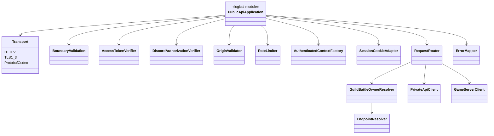
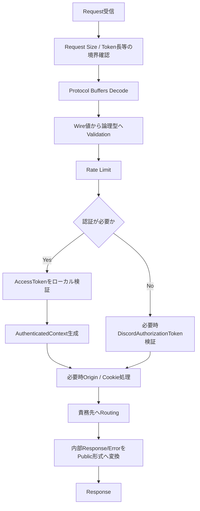

# Public API Serverプログラミング設計

## 結論

Public API ServerはstatelessなEdge Adapterとして実装し、Domain状態・Database transaction・戦闘状態を所有しません。

## 論理Module

## Request Pipeline

処理のうちDomain invariantはPublic APIで確定しません。

## AccessToken検証

Public API ServerはAccessTokenをDatabaseへ問い合わせずローカル検証します。

検証対象は仕様で定義された以下です。

- Ed25519署名
- `alg=EdDSA`
- `iss`
- `aud=game-api`
- `exp`等のToken時刻
- `sub`のAccountID
- `player_id`
- `sid`
- PlayerID Binding

署名秘密鍵は保持しません。

## CreateAccount / Login

`DiscordAuthorizationRequired=true`ではDiscord Botが発行した`DiscordAuthorizationToken`をPublic API Serverでローカル検証します。

LoginではClientVersionをPublic API Serverが要求するVersionと比較し、不一致時は定義済みVersion Errorを返します。

Private APIからRefreshTokenを受け取った場合、Client Bodyへ返さず`__Host-RefreshToken` Cookieへ設定します。

## Refresh / Logout

- RefreshTokenはHttpOnly Cookieから取得します。
- Origin検証を行います。
- Refresh成功時は回転後RefreshTokenをCookieへ再設定します。
- Logout成功時はCookieを無効化します。

Cookie属性の正本はSession仕様を使用します。

## Rate Limit / Boundary Limit

Public APIのRate LimitはTransportの接続制限だけではなくApplicationレベルでも適用します。Ingress側のSource IP Rate Limitは別レイヤです。

具体的な値は仕様で固定値または推奨値として記載されたものだけをConfigurationとして扱い、本設計で新しい値を追加しません。

## GuildBattle Owner解決

- `GUILD_BATTLE.game_server_instance_id`がOwnerの正本です。
- EndpointSlice等からInstanceIDと到達Endpointを対応させます。
- 通常のService Load Balancingで任意GameServerへ送信しません。
- GameServer自身もOwner一致を再確認します。

## Stateless条件

Public APIで保持してよいCacheはRoutingや検証を高速化するための派生情報に限定します。以下を正本として保持しません。

- Account Session状態
- Guild Membership状態
- Arena Party状態
- GuildBattle runtime状態
- GuildBattle ownerの永続状態

## GuildBattle通知ストリーム

`SubscribeGuildBattleUpdates`は通常の単発Responseと異なり, AccessToken検証・GuildBattle Owner解決後, 所有GameServerから受信する`GuildBattleScoreUpdate`をClientのHTTP/2 Response streamへ中継します。Serverは`GuildBattleID`が一致する購読者にだけ配信し, Clientの所属Guildに対応するAlly/Enemy Score, Chain, ChainRemainingMillisecondsを使用します。時間経過によるチェインリセットだけの通知は中継しません。30:00でストリームを終了しますが, 30:00までに受付済みで当該Playerの処理が待機中ならその要求完了時点まで維持します。Public API Podは接続単位のハンドル以外にスコアや購読一覧を正本として永続管理しません。通信断では購読を終了し, ClientはGetGuildBattleStatusで状態を再同期します。

## Retry

仕様でRetry回数・冪等性が明示されていない内部要求について、Public API共通機構で自動Retryを追加しません。GuildBattle DB更新等のRetryは責務を持つGameServer / Private API側の仕様に従います。

## メリット・デメリット

### メリット

- 水平スケール時にSession affinityを要求しません。
- 認証・RoutingとDomain Logicの責務が分離されます。
- 内部Componentが自身の状態で最終認可するためEdge状態への依存を減らせます。

### デメリット

- GuildBattleはOwner解決とEndpoint解決が必要です。
- Token失効を毎要求Database照会しないため、Logout後のAccessTokenは有効期限まで有効というSession仕様を受け入れる必要があります。

## 情報源

- `design/server/public_api_responsibility.md`
- `design/server/public_api.md`
- `design/server/api.md`
- `design/server/api_payload.md`
- `design/server/session.md`
- `design/server/game_server.md`
- `design/system/network.md`
- `design/system/public_api.proto`
