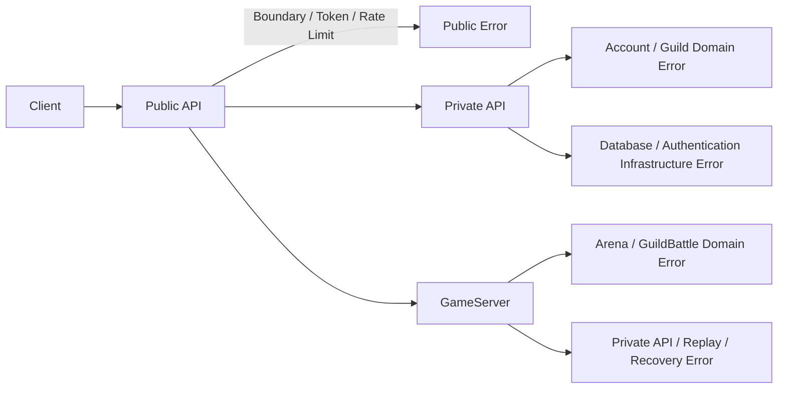

# Error設計

## 概要

Errorは「Boundary / Security」「Domain rejection」「Upstream / Infrastructure」を混在させず、Public APIで最終的に既定のResponseへ変換します。

## Errorの発生位置

## Public API Error Code

`ApiErrorCode`は`design/shared/types.md`および`public_api.proto`を正本とします。実装側で独自の公開Error Codeを増やしません。

主な分類は以下です。

- AccessToken / RefreshToken / Credential
- Discord Authorization
- ClientVersion
- Guild権限・所属変更
- Party Validation
- Arena
- GuildBattle参加・出撃・Tactics・Item・Heal・Revive
- RequestSequence
- Rate Limit
- GameServer unavailable
- Required operation failure

## Domain rejectionと障害の違い

BP不足、CT中、Tactics使用回数不足等の正常なゲームルール拒否は障害ログへ要求単位で出力しません。Metricへ集約します。

RequestSequence不一致、不正ID、所有していないGuildBattleへの操作等はSecurity Eventとして扱い、Memory集約後に非同期ログへ出します。

## Required Operation

Login後の初期Guild作成等、仕様上必要な後続処理が再試行後も失敗した場合は`RequiredOperationErrorResponse`を使用します。

## Error変換責務

- Private API / GameServerはDomain上の理由を返します。
- Public APIはその結果を既定Public Responseへ変換します。
- Public APIはDomain上の可否を代わりに判断しません。

## 参照資料

- `design/shared/types.md`
- `design/system/public_api.proto`
- `design/server/public_api_responsibility.md`
- `design/system/log.md`
- `design/server/session.md`
