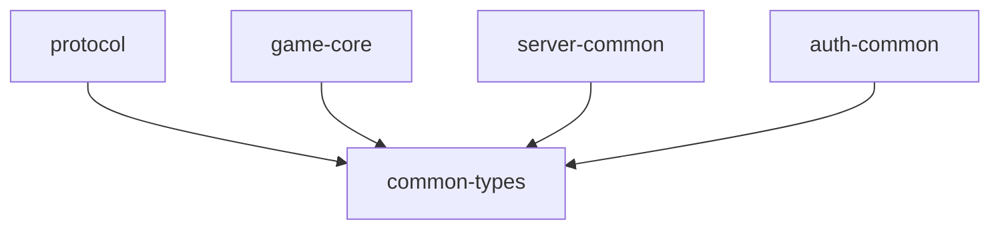

# 共有crate設計

## 概要

共有内部crateは仕様に明示された`game-core`、`protocol`、`common-types`、`server-common`、`auth-common`を基本単位とします。

## crate責務

| crate | 責務 | 利用Component |
|---|---|---|
| `game-core` | 戦闘計算、PRNG、外部I/Oを伴わないゲーム計算 | Client / GameServer |
| `protocol` | Protocol Buffers生成型 | Client / Public API / Private API / GameServer / Coordinator |
| `common-types` | ID、数値、Version、Enum等の論理型 | 全体 |
| `server-common` | TLS、Server共通処理等 | Server Component |
| `auth-common` | JWT Claim等の認証共通処理 | Public API / Private API / Discord Bot |

`protocol`が生成する型の入力は`design/system/public_api.proto`, `design/system/guild_battle_replay.proto`, `design/system/game_types.proto`, `design/system/master_data.proto`とする.

## 依存ルール

`game-core`は原則`std`だけへ依存するという既存方針を維持します。

## 外部crate

現行資料ではComponentごとのRust crateがすでに指定されています。プログラミング設計側で別ライブラリへ置き換えません。

- Public API: `tokio`, `axum`, `axum-server`, `rustls`, `reqwest`, `prost`, `serde`, `serde_json`, `jsonwebtoken`, `base64`, `time`
- Private API: 上記相当のServer系に加え`sqlx`, `argon2`, `sha2`, `getrandom`, `uuid`
- GameServer: `tokio`, `axum`, `axum-server`, `rustls`, `reqwest`, `prost`, `serde`, `serde_json`, `uuid`, `time`, `game-core`
- Coordinator: `tokio`, `rustls`, `reqwest`, `prost`, `serde`, `serde_json`, `uuid`, `time`等
- Kubernetes本番追加: `kube`, `k8s-openapi`

## 参照資料

- `design/system/rust_dependencies.md`
- `design/shared/types.md`
