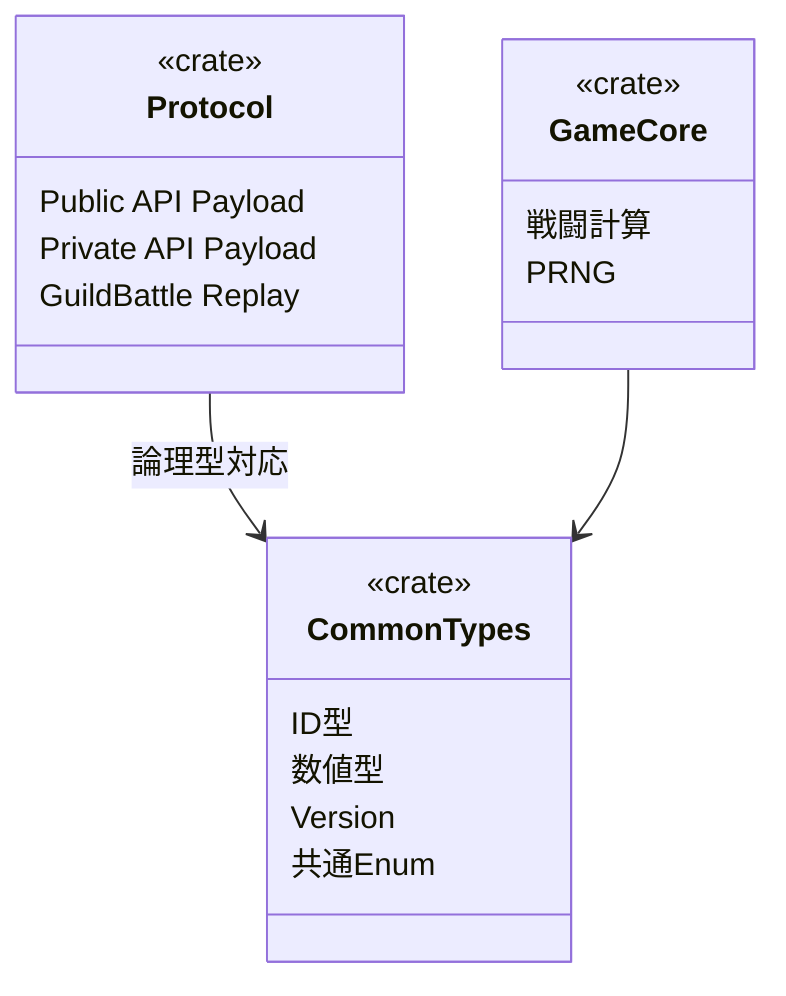

# 共有crate設計

## 結論

共有内部crateは資料に明示されている`game-core`、`protocol`、`common-types`、`server-common`、`auth-common`を基本単位とする。

## 責務

| crate | 責務 | 主な利用Component |
|---|---|---|
| `game-core` | 戦闘計算、PRNG、ゲーム計算 | Client / GameServer |
| `protocol` | Protocol Buffers生成型・通信Payload | Client / 各Server / Coordinator |
| `common-types` | ID、数値型、Version、共通型 | 全体 |
| `server-common` | Server共通処理 | 各Server |
| `auth-common` | 認証関連共通処理 | Public API / Private API / Discord Bot |

## 型の境界

Protocol Buffersに`u8` / `u16`が存在しないため、wireでは`uint32`を使用し、受信時に論理型の範囲を検証するという既存設計に従う。

## Version

`Version`はGuildBattle Replayで使用したゲームロジックとMasterDataの組み合わせを一意に識別する。

ClientとGameServerでArenaを再現するため、同一Versionのゲームロジックを使用する。

## 情報源

- `design/system/rust_dependencies.md`
- `design/shared/types.md`
- `design/shared/common_data_struct.md`
- `design/system/public_api.proto`
- `design/system/guild_battle_replay.proto`
- `design/game/master_data_pipeline.md`
