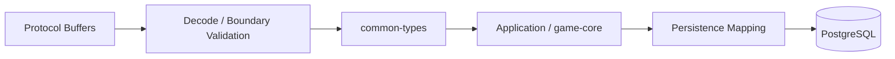
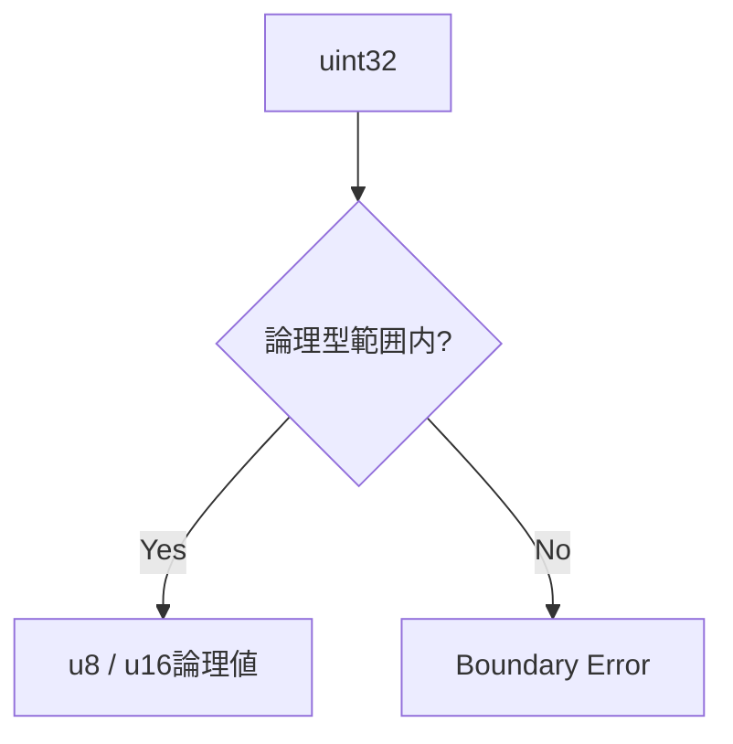

# 論理型と変換境界

## 概要

Rust内部では、仕様の論理型をDomain境界として扱います。Protocol Buffers型やDatabase物理型をそのままゲームロジックへ渡さない構造にします。

## 型レイヤー

## ID

現仕様で定義されている主なIDは以下です。

- `AccountID`
- `DiscordUserID`
- `PlayerID`
- `GuildID`
- `GuildBattleID`
- `SessionID`
- `DiscordAuthorizationTokenID`
- `RecordID`
- `CharacterID`
- `SkillID`
- `AbilityID`
- `TacticsID`
- `FormationID`
- `ItemID`
- `FormationSlotID`
- `SlotIndex`

予約値は`design/shared/types.md`を正本とし、Decode時またはDomain入口で拒否します。

## 数値型

ゲーム計算で重要な型は、`HP`, `Attack`, `Defense`, `BP`, `TP`, `Score`, `Sequence`, `RequestSequence`, `Seed`, `Count`, `Stage`, `DurationSeconds`, `GameServerTime`, `Float32`, `Rate`, `CorrectionValue`, `ConditionValue`です。

32bit浮動小数点を使用する式は、演算順を変更しません。

## wire変換

Protocol Buffersには`u8` / `u16`がないため、wire上の`uint32`から以下を明示変換します。

## Runtime構造

仕様に定義済みの以下の構造は、ゲーム実行時状態として直接利用できる単位です。

- `PartyCharacterStatus`
- `BuffDebuffEffectState`
- `StatusAbnormalityState`
- `SkillBattleState`
- `AbilityBattleState`
- `CharacterBattle`
- `HitPoints`
- `TacticsBattleState`
- `GuildBattlePlayerRuntimeState`
- `TacticsBattleSpecialParameters`
- `TacticsBattleSpecialData`
- `TacticsActiveEffectState`

`SkillBattleState`と`AbilityBattleState`は戦闘中だけの状態で、Databaseへ永続化しません。

## Version

`Version`は対象Replayで使用したゲームロジックとMasterDataの組み合わせを一意に識別します。

Client / GameServerのArena再現、GuildBattle ReplayではVersion一致を前提とします。

## 参照資料

- `design/shared/types.md`
- `design/shared/common_data_struct.md`
- `design/system/public_api.proto`
- `design/system/guild_battle_replay.proto`
