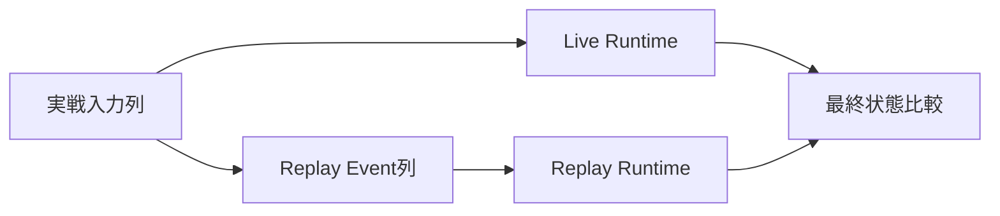

# テストプログラミング設計

## 結論

テストは、`game-core`の純粋計算、Component境界をまたぐ結合、PRNG再現性、GuildBattle Replay、障害復旧を分離します。仕様未確定事項を期待値として固定せず、同じ入力・Seed・Versionから同じ結果を得ることを最優先にします。

## 論理配置

```text
tests/
├── integration/
│   ├── account_session/
│   ├── guild/
│   ├── arena/
│   ├── guild_battle/
│   └── coordinator/
├── reproducibility/
│   ├── arena/
│   ├── guild_battle/
│   ├── ability_skill/
│   └── tactics/
├── replay/
└── failure/
```

`game-core`内部の単体テストは各Module内へ置いて構いません。上記は責務区分を示す論理配置です。

## 単体テスト

外部I/Oを伴わない処理を対象にします。

### 数値・戦闘

- Damage計算
- Skill Damage
- HP / BP / TP Clamp
- PartyRank
- Skill対象選択
- Ability発動条件・発動回数
- Tactics段階効果・終了条件
- Castle Break確率
- GuildBattle Score
- GuildBattleID生成

IEEE-754 32bit浮動小数点として、仕様に記載された演算順を変えずに期待値を評価します。代数的に同値な別式への変形を前提にしません。

### PRNG

- `Random::new`
- `next`
- `next_u32`
- `next_bounded`
- Shuffle
- 重み付き抽選
- Seed生成

固定Seedに対する乱数列を検証し、PRNGを使わない処理で状態が変化しないことも確認します。

### Validation

- Version比較
- Arena / GuildBattle編成
- MasterData
- Skill Effect × Target Range
- Ability Effect × Condition × Target
- Tactics Battle Special許可組合せ
- Wire `uint32`から内部`u8` / `u16`等への範囲変換

## 結合テスト

実Application境界の契約を対象にします。

### Account / Session

- Account + Player同一Transaction作成
- Login
- AccessToken発行
- Refresh rotation
- concurrent refreshで1件だけ成功
- previous token再利用時のSession削除
- Logout
- Discord Role喪失Session revoke
- AccessTokenがLogout後も`exp`までは署名上有効という仕様

### Guild

- Join申請・承認
- Invitation・承諾
- Leave / Guild移動
- Leader / Subleader更新
- 20人上限をTransaction内で再確認
- `membership_locked=true`時の変更拒否

### Arena

- Party登録からBattle開始
- ClientVersion mismatch
- 自身Arena Party未登録
- Friend対象Player不存在とParty未登録のError分離
- Server編成とClient編成同期
- Random候補にPlayerID `0`を含めない

### GuildBattle Lifecycle

- `scheduled -> preload_failed`
- `scheduled -> in_progress`
- `in_progress -> resolving`
- `resolving -> completed`
- 未許可遷移拒否
- Owner mismatch拒否
- `RetryPreloadFailedGuildBattle`
- `RematchPreloadFailedGuildBattles`

### Coordinator

候補選択順を次の順序で検証します。

1. ready
2. AvailableGuildBattleThreadCount降順
3. Thread使用率昇順
4. LastAssignedAt昇順
5. GameServerInstanceID昇順

未割当`scheduled`の再割当、Endpoint消失時のassigned scheduled再割当、`in_progress`を自動再割当しないことも確認します。

## 再現性テスト

### Arena

同一の以下からClient側とGameServer側で最終状態が一致することを確認します。

- Version
- MasterData
- 初期状態
- Seed

### GuildBattle本体PRNG

- 同一InitialSeedと同一成立Event列でPRNG状態が一致します。
- 初回Joinごとに成立順で1回だけ消費します。
- 再Joinでは消費しません。
- 出撃用Random生成・対象抽選の消費順が一致します。

### Battle

- Skill target random
- Ability同順位random
- Formation競合random
- Character selection
- Damage random

仕様で候補順序が固定されている箇所は、その順序も期待値として検証します。

### Tactics

- Random要素ありでGuildBattle本体PRNGを1回だけ消費します。
- 取得SeedからTactics専用PRNGを生成します。
- 以後GuildBattle本体PRNGをTactics固有抽選へ使用しません。
- Random要素なしでは本体PRNG状態を変更しません。
- Seed値が`0`でもMasterData上Random要素ありならRandom利用として扱うロジックを検証します。

## Replayテスト



最低限以下を比較します。

- Guild Score
- Player HP
- BP
- TP
- Chain
- Active Tactics状態
- Item残数
- 勝敗結果

追加で以下を検証します。

- 最初のEventがCreate
- InitialSnapshotだけから開戦時可変状態を復元
- length-delimited Protocol Buffers読込
- `process_type`と`oneof`一致
- Join Eventで本体PRNGを1回消費
- Replay時に現在DB可変値を使わない
- Replay Versionに対応するgame logic / MasterDataを使う

## RequestSequenceテスト

Player単位で以下を確認します。

```text
初回Join -> random sequence
成功操作 -> +1
失敗操作 -> 変化なし
GetGuildBattleStatus -> 変化なし
再Join -> 現在値返却、PRNG消費なし
```

他Playerとの同値Sequenceをエラー扱いしません。

## DB冪等性テスト

同一Operation IDで次の順に実行します。

1. 初回更新成功
2. Response消失を模擬
3. 同一Operation IDでRetry
4. Domain更新が1回しか適用されないことを確認
5. 初回成功Response相当が返ることを確認

Recovery fileからの再送でも同じテストを行います。

## 障害テスト

- Preload中1 Player取得失敗で対象Battleだけ`preload_failed`
- 他Battle継続
- Scale要求失敗時は未割当`scheduled`維持
- DB送信1回失敗後、同一要求を1回Retry
- 2回失敗でRecoveryへ移行
- Recovery再送でOperation ID維持
- GameServer再起動後のRecovery scan / resend
- 全件成功したfileだけ削除
- `CompleteGuildBattle`失敗時の全体Rollback
- Coordinator再起動後のDB Reconcile

## Queue / Logテスト

### System Log Queue

- boundedであること
- DEBUG / INFO drop時にMetric加算
- WARN / ERROR優先領域
- Credential redaction

### ReplayQueue

- boundedであること
- Eventをdropしないこと
- 満杯時Backpressure
- State / RequestSequence更新後にenqueueされること
- enqueue順が成立順と一致すること

## MasterData Pipelineテスト

- Parse
- Normalize
- Validation
- ProcessedMasterData生成
- DB fixed data生成
- Cross Check
- Character / Skill / Ability / Tacticsの同一Normalized source由来一致
- 未定義Effectへ値を補完しないこと

## Regressionルール

仕様変更により確定挙動が変化した場合、対応するテスト期待値も同じ変更単位で更新します。

仕様に記載されていない挙動について「現在の実装結果」をRegression期待値として固定しません。

## 情報源

- `design/test/test_policy.md`
- `design/game/battle.md`
- `design/game/pseudorandom.md`
- `design/game/master_data_pipeline.md`
- `design/server/guild_battle.md`
- `design/server/guild_battle_coordinator.md`
- `design/server/guild_battle_lifecycle.md`
- `design/server/data_base.md`
- `design/server/session.md`
- `design/system/log.md`
- `design/system/guild_battle_replay.proto`
