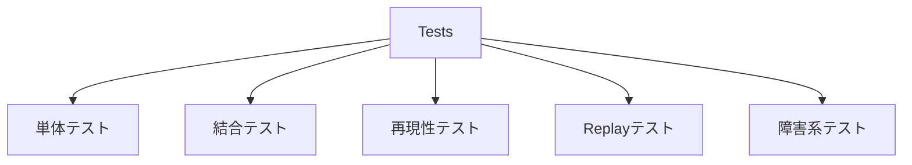

# テスト構造の大枠

## 結論

既存テスト方針に従い、単体、結合、再現性、Replay、障害系を分離する。

仕様未確定項目についてテスト側で期待値を補完しない。

## テスト分類



## 配置案

```text
tests/
├── integration/
├── reproducibility/
└── replay/
```

各crate内部の数式・Validation・状態遷移等は、そのcrateの単体テストとして保持する。

## 最重要境界

- 同一Seed / 初期状態 / 入力列による再現性
- ClientとGameServerのArena計算一致
- GuildBattle本体PRNGの消費順
- GuildBattle Replayからの完全再現
- `X-Operation-ID`の冪等性
- GuildBattle Lifecycleの許可された状態遷移だけが成立すること
- Database Recoveryの生成・再送・削除
- MasterData Validation

## 情報源

- `design/test/test_policy.md`
- `design/game/pseudorandom.md`
- `design/system/guild_battle_replay.proto`
- `design/server/guild_battle_lifecycle.md`
