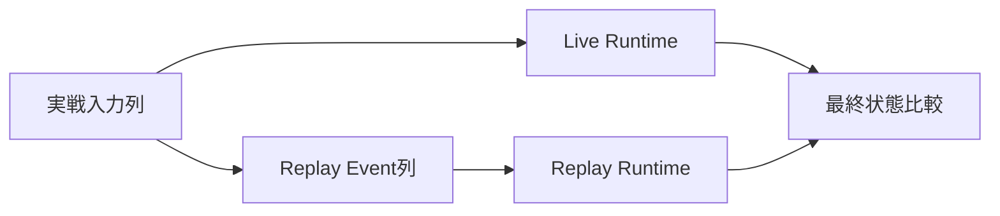

# テストプログラミング設計

## 概要

テストは、`game-core`の純粋計算、Component境界をまたぐ結合、PRNG再現性、GuildBattle Replay、障害復旧を分離します。仕様未確定事項を期待値として固定せず、同じ入力・Seed・Versionから同じ結果を得ることを最優先にします。

## 論理配置

```text
tests/
├── integration/
│   ├── account_session/
│   ├── guild/
│   ├── arena/
│   ├── guild_battle/
│   └── coordinator/
├── reproducibility/
│   ├── arena/
│   ├── guild_battle/
│   ├── ability_skill/
│   └── tactics/
├── replay/
└── failure/
```

`game-core`内部の単体テストは各Module内へ置いて構いません。上記は責務区分を示す論理配置です。

## 単体テスト

外部I/Oを伴わない処理を対象にします。

### 数値・戦闘

- Damage計算
- Skill Damage
- HP / BP / TP Clamp
- PartyRank
- Skill対象選択
- Ability発動条件・発動回数
- Tactics段階効果・終了条件
- Castle Break確率
- GuildBattle Score
- GuildBattleID生成
- CB専用Abilityのキャラクター別・効果種別別に各1回の判定と攻撃力UP/ダメージUPの独立成立
- CBイベント種別とキリ番専用Tacticsの適用条件・スコア計算フロー
- チェイン残り時間（ミリ秒）の0～300000 clampと5分ちょうど境界

IEEE-754 32bit浮動小数点として、仕様に記載された演算順を変えずに期待値を評価します。代数的に同値な別式への変形を前提にしません。

### PRNG

- `Random::new`
- `next`
- `next_u32`
- `next_bounded`
- Shuffle
- 重み付き抽選
- Seed生成

固定Seedに対する乱数列を検証し、PRNGを使わない処理で状態が変化しないことも確認します。

### Validation

- Version比較
- Arena / GuildBattle編成
- MasterData
- Skill Effect × Target Range
- Ability Effect × Condition × Target
- Tactics Battle Special許可組合せ
- Wire `uint32`から内部`u8` / `u16`等への範囲変換

## Client動作テスト

- ログイン不可またはServer未接続の場合はタイトルからホーム画面へ遷移でき, 他のすべての機能が使用不可であることを確認します。
- Server接続および必要な認証が復帰した場合は通常のすべての機能が使用可能に戻ることを確認します。
- タイトル画面にキャッシュクリアとアセット追加のボタンがあることを確認します。
- 「アセットの追加」から専用シーンへ遷移することと, PNG/HCAの取り込み, 選択ディレクトリ配下の再帰探索, 拡張子を含むUTF-8ファイル名の大小文字を区別したSHA-256算出, ファイル名SHA-256→内容SHA-256→対応配置先パスの二段辞書による自動配置, 同名ファイルの内容SHA-256による配置先判別, OPFSへの割当保存/復元を確認します。
- キャッシュクリアがOPFS内の`cache`フォルダのファイルだけに作用し, アセット本体と割当情報を削除しないことを確認します。

### 初期Clientプロトタイプの検証

- LAN内のローカルWebサーバーへ複数の実機からIPアドレスを直接指定して接続し, JS/WASM/PNGの静的資源を取得できることを確認します。
- タイトルで`proto_type_title.png`が表示され, 仮ホームへの画面遷移後に`proto_type_home.png`が表示されることを確認します。
- 複数のテスト用ボタンへのタッチ/マウス入力の反応を確認します。
- GameServer・Public API Serverへ通信しないプロトタイプ専用ビルドとして検証し, 完成版の未接続時制限を変更しません。
- 正式公開先のVercel／GitHub Pagesの配布確認, OPFS・PWA等の安全なコンテキストを必要とする機能は別の検証段階とします。

### ブラウザ実装・アセット・音声の検証

対象端末で以下を検証し、結果を記録します。

- `wasm32-unknown-unknown`を対象に依存を解決し, `Cargo.lock`固定後に`cargo tree --target wasm32-unknown-unknown`および`cargo build --target wasm32-unknown-unknown --release --locked`を確認します。
- iPhone Safari/PWAおよびAndroid Chrome/PWAで, ユーザー選択PNG/HCAのOPFSへのコピーを検証します。OPFSのセマンティックバージョン別配置と新バージョン検証後の切替, 取り込み中断からの回復を確認します。フォルダ選択と元ファイルの削除を伴う移動はブラウザごとに実現可否を確認します。
- PNGが`File` / `Blob`から`createImageBitmap()`で読み込め, WebGL 2テクスチャ化・描画できることを確認します。表示終了時の`ImageBitmap.close()`と`deleteTexture()`による資源解放を確認します。
- 40キャラクターと代表的エフェクトをWebGL 2で描画し, GPU負荷80%以下, 実行時メモリ2GB以下, FPS30以上を基準として計測します。メモリ計測範囲・GPU計測方式・端末条件は未確定であり, 条件確定後に合否判定します。
- `cridecoder`によるHCAのWASM向けビルドとiPhone Safariでの音声再生が可能か確認します。採用確定は合格後とします。
- 短いSE・ボイスの`AudioBuffer`再利用と, 長いBGM・ボイスのPCM逐次供給（`AudioWorklet` / `MessagePort`）を確認します。長い音声を全体PCM展開せず再生することを確認します。
- HCAの一部ループ, チャンネル数, 22,050Hz, 非暗号化, 再生開始遅延, 欠音, SE同時最大5を確認します。AudioWorkletの`process()`内にHCAデコードや大きなメモリ確保を置かないことを確認します。PCM先読み量はデコード・I/O・音声スケジューリングの実測値から評価します。
- GPUテクスチャ, デコード済みPCM, WASMヒープ, ブラウザ一時メモリを分けて観測します。iOS端末で長時間の騎士団戦を行い, 強制再読み込みの有無を確認します。
- `opt-level = 3`と`opt-level = "z"`で圧縮後WASMサイズ, HCAデコード時間, 初回ロード時間を比較し, Client依存とライセンスを監査します。WASMサイズ上限500MBは指定済みですが, 圧縮前後・計測方法・実測結果は未確定/未記録です。

ClientとPublic API Server間はHTTP/2 over TLS 1.3で通信し, API PayloadはProtocol Buffersであることを確認します。`SubscribeGuildBattleUpdates`ではHTTP/2 Response stream上の`GuildBattleScoreUpdate`をProtocol Buffers varint長prefix付きで受信できることを確認します。Public APIの通信方式としてWebSocketは使用しません。ブラウザ標準`fetch()`/`ReadableStream`と既存crateによる通信を検証し, HTTP/2/TLS 1.3のネゴシエーション結果を確認します。GitHub Pages配布Origin・API Origin・`SameSite=Strict` RefreshToken・CORS/Credentialsの整合性も確認します。

PNG/HCAのOPFS保存・割当情報の復元・キャッシュクリアの範囲を検証します。

## 結合テスト

実Application境界の契約を対象にします。

### Account / Session

- Account + Player同一Transaction作成
- Login
- AccessToken発行
- Refresh rotation
- concurrent refreshで1件だけ成功
- previous token再利用時のSession削除
- Logout
- Discord Role喪失Session revoke
- AccessTokenがLogout後も`exp`までは署名上有効という仕様

### Guild

- Join申請・承認
- Invitation・承諾
- Leave / Guild移動
- Leader / Subleader更新
- 20人上限をTransaction内で再確認
- `membership_locked=true`時の変更拒否

### Arena

- Party登録からBattle開始
- ClientVersion mismatch
- 自身Arena Party未登録
- Friend対象Player不存在とParty未登録のError分離
- Server編成とClient編成同期
- Random候補にPlayerID `0`を含めない

### GuildBattle Lifecycle

- `scheduled -> preload_failed`
- `scheduled -> in_progress`
- `in_progress -> resolving`
- `resolving -> completed`
- 未許可遷移拒否
- Owner mismatch拒否
- `RetryPreloadFailedGuildBattle`
- Retry時, 旧IDを`replaced`, 新IDを`scheduled`で保持し, 開戦予定時刻とマッチング枠を別に持つこと
- 中止時, `CancelPreloadFailedGuildBattle`で`canceled`へ遷移させ, 終端状態と未完了状態の混在を判定すること
- `BP`の`u16`境界値255/256/500/65535とwire`uint32`入力の範囲検査
- `SortieScore`は`f32`, guild合計`Score`は`u64`で, 端数のある複数出撃結果を加算する場合に合計加算時だけ切り捨てること
- 城防御補正が`parameters.castle_level`を1度だけ参照すること
- `RematchPreloadFailedGuildBattles`
- 同一開始時刻の複数対戦中, 最初のCompletedでは除外Guildを解除せず, 最後のCompletedでのみロック解除・除外一覧削除（並行Completeを含む）
- `SubscribeGuildBattleUpdates`の初回スナップショット・所属基準の両Guildスコアとチェイン/残り時間・複数購読者への配信
- 出撃Response送信後に出撃後効果・Replay・更新通知, 次要求処理の前に後処理完了
- チェイン時間経過リセットではPushしない, 通信断後はGetGuildBattleStatusの値へ再同期する
- 開戦30:00の購読正常終了と, 30:00以前のキュー待ちPlayerだけ処理完了後に終了する分岐

### Coordinator

候補選択順を次の順序で検証します。

1. ready
2. AvailableGuildBattleThreadCount降順
3. Thread使用率昇順
4. LastAssignedAt昇順
5. GameServerInstanceID昇順

未割当`scheduled`の再割当、Endpoint消失時のassigned scheduled再割当、`in_progress`を自動再割当しないことも確認します。

## 再現性テスト

### Arena

同一の以下からClient側とGameServer側で最終状態が一致することを確認します。

- Version
- MasterData
- 初期状態
- Seed

### GuildBattle本体PRNG

- 同一InitialSeedと同一成立Event列でPRNG状態が一致します。
- 初回Joinごとに成立順で1回だけ消費します。
- 再Joinでは消費しません。
- 出撃用Random生成・対象抽選の消費順が一致します。

### Battle

- Skill target random
- Ability同順位random
- Formation競合random
- Character selection
- Damage random

仕様で候補順序が固定されている箇所は、その順序も期待値として検証します。

### GuildBattle殲滅のClient/Server一致

`GuildBattleAnnihilationResponse`の`OwnCharacters`, `EnemyCharacters`, `EnemyPlayerID`, `EnemyFormationID`, `BattleTacticsEffects`, `Seed`とJoin時同期済み編成を同一入力として, Client/Serverの戦闘中の選択・最終HP・計算結果が一致することを検証します。最大HP依存回復, 効果持続, PlayerIDによる候補順についても検証し, Clientの直前表示HPを戦闘入力に使用しないことを確認します。

### Tactics

- Random要素ありでGuildBattle本体PRNGを1回だけ消費します。
- 取得SeedからTactics専用PRNGを生成します。
- 以後GuildBattle本体PRNGをTactics固有抽選へ使用しません。
- Random要素なしでは本体PRNG状態を変更しません。
- Seed値が`0`でもMasterData上Random要素ありならRandom利用として扱うロジックを検証します。

## Replayテスト



最低限以下を比較します。

- Guild Score
- Player HP
- BP
- TP
- Chain
- Active Tactics状態
- Item残数
- 勝敗結果

追加で以下を検証します。

- 最初のEventがCreate
- InitialSnapshotだけから開戦時可変状態を復元
- length-delimited Protocol Buffers読込
- `process_type`と`oneof`一致
- Join Eventで本体PRNGを1回消費
- Replay時に現在DB可変値を使わない
- Replay Versionに対応するgame logic / MasterDataを使う

## RequestSequenceテスト

Player単位で以下を確認します。

```text
初回Join -> random sequence
成功操作 -> +1
失敗操作 -> 変化なし
GetGuildBattleStatus -> 変化なし
再Join -> 現在値返却、PRNG消費なし
```

他Playerとの同値Sequenceをエラー扱いしません。

## DB冪等性テスト

同一Operation IDで次の順に実行します。

1. 初回更新成功
2. Response消失を模擬
3. 同一Operation IDでRetry
4. Domain更新が1回しか適用されないことを確認
5. 初回成功Response相当が返ることを確認

Recovery fileからの再送でも同じテストを行います。

## 障害テスト

- Preload中1 Player取得失敗で対象Battleだけ`preload_failed`
- 他Battle継続
- Scale要求失敗時は未割当`scheduled`維持
- DB送信1回失敗後、同一要求を1回Retry
- 2回失敗でRecoveryへ移行
- Recovery再送でOperation ID維持
- GameServer再起動後のRecovery scan / resend
- 全件成功したfileだけ削除
- `CompleteGuildBattle`失敗時の全体Rollback
- Coordinator再起動後のDB Reconcile

## Queue / Logテスト

### System Log Queue

- boundedであること
- DEBUG / INFO drop時にMetric加算
- WARN / ERROR優先領域
- Credential redaction

### ReplayQueue

- boundedであること
- Eventをdropしないこと
- 満杯時Backpressure
- State / RequestSequence更新後にenqueueされること
- enqueue順が成立順と一致すること

## MasterData Pipelineテスト

- Parse
- Normalize
- Validation
- ProcessedMasterData生成
- DB fixed data生成
- Cross Check
- Character / Skill / Ability / Tacticsの同一Normalized source由来一致
- 未定義Effectへ値を補完しないこと

## Regressionルール

仕様変更により確定挙動が変化した場合、対応するテスト期待値も同じ変更単位で更新します。

仕様に記載されていない挙動について「現在の実装結果」をRegression期待値として固定しません。

## 参照資料

- `design/test/test_policy.md`
- `design/game/battle.md`
- `design/game/pseudorandom.md`
- `design/game/master_data_pipeline.md`
- `design/server/guild_battle.md`
- `design/server/guild_battle_coordinator.md`
- `design/server/guild_battle_lifecycle.md`
- `design/server/data_base.md`
- `design/server/session.md`
- `design/system/log.md`
- `design/system/guild_battle_replay.proto`
- 添付`rust_wasm_png_hca_library_selection(1).md`（2026-10-09）, 第1～7節.
