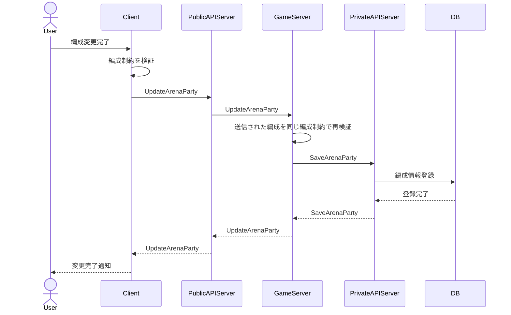
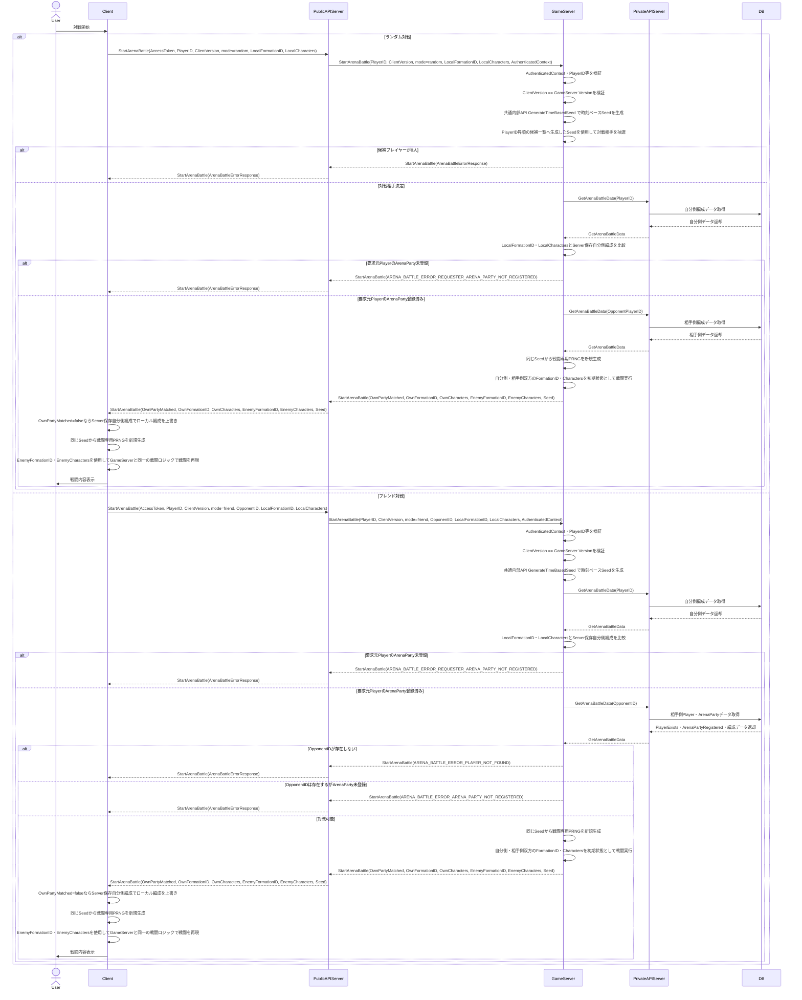

## シーケンス

### 編成登録時

### 対戦時

## ランダム対戦候補同期

GameServerはPrivateAPIの`GetAllPlayerIDs`を使用してDatabase上でArenaParty登録済みのPlayerIDだけをPlayerID昇順で取得し, その順序を維持してランダムアリーナ候補のPlayerIDキャッシュを同期する. ArenaParty未登録Playerは候補へ含めない. 抽選時は自身のPlayerIDを候補から除外し, 残りの候補もPlayerID昇順のまま「抽選」へ渡す.
