## シーケンス

騎士団戦参加時, GameServerは`GuildBattleID`単位で`PlayerID -> RequestSequence`マップを作成する. 初期値は0で, 参加成功時に騎士団戦本体PRNGを1回消費して`next_bounded(1,000,000,000) + 1`を求め, `RequestSequence`として割り当てる. 他プレイヤーとの`RequestSequence`重複は許可する. 参加後の要求は保持値と一致する`RequestSequence`のみ処理し, 成功するたびに1加算した`NextRequestSequence`をClientへ返す. 失敗時は加算しない. JoinによるPRNG消費もリプレイ再現対象とする.

相手プレイヤーの重み付き抽選へ渡す候補PlayerIDはPlayerID昇順とする.

### 編成登録時

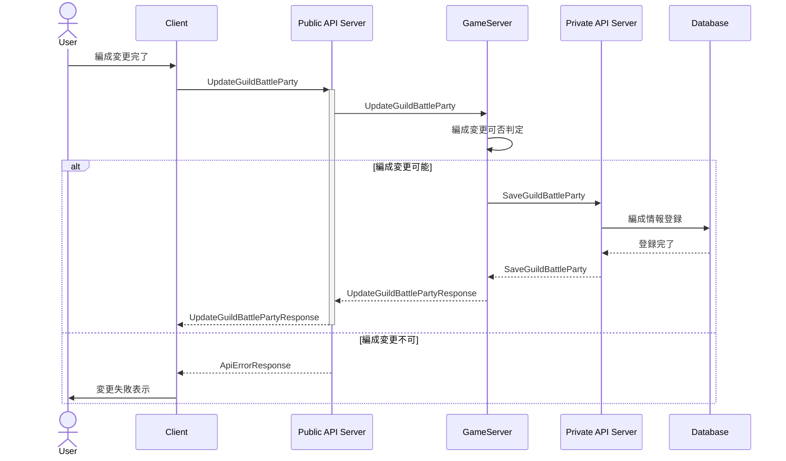

### 騎士団戦参加時

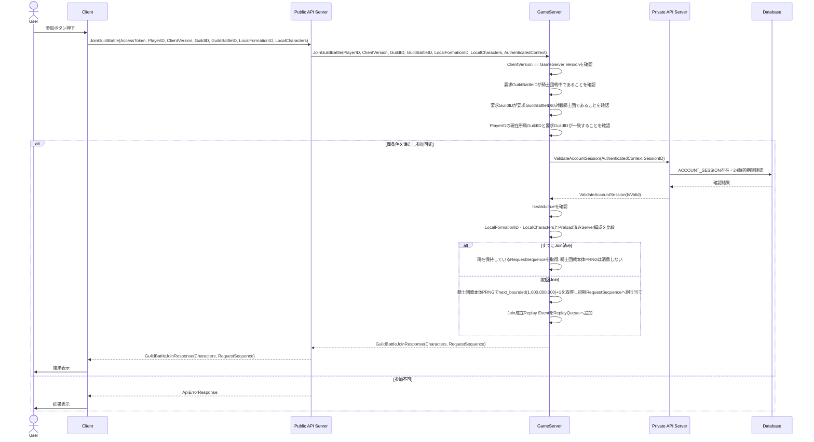

### 騎士団戦

#### 騎士団戦開戦前

騎士団戦開戦前処理は開戦5分前に開始する.
対象開始時刻の騎士団は, 対戦組み合わせ生成前にDatabaseの`GUILD.membership_locked=true`へ更新して加入・脱退を禁止し所属を固定する. 所属変更禁止状態の正本はDatabaseとする.
所属固定後に対戦組み合わせを生成する.
騎士団戦の生成, マッチング, GameServer割当およびPreload開始指示は`GuildBattleCoordinator`だけが行う.
GameServerは未割当騎士団戦の検索・自己割当・マッチング生成を行わず, `GuildBattleCoordinator`から割り当てられた騎士団戦だけをPreload・実行する.

```mermaid
sequenceDiagram
    participant DiscordBot as Discord Bot
    participant GuildBattleCoordinator
    participant GameServerScaleController as Dedicated GameServer Scale Controller
    participant GameServer
    participant PrivateAPIServer as Private API Server
    participant Database

    Note over GuildBattleCoordinator,Database: 開戦5分前. GuildBattleCoordinatorが対象開始時刻の騎士団戦開戦前処理を開始
    GuildBattleCoordinator->>PrivateAPIServer: GetGuildsForBattleMatching(TargetDate, GuildBattleStartTime)
    PrivateAPIServer->>Database: 対象開始時刻のGuildID・所属人数一覧を取得
    Database-->>PrivateAPIServer: GuildBattleMatchCandidate[]
    PrivateAPIServer-->>GuildBattleCoordinator: GetGuildsForBattleMatching
    GuildBattleCoordinator->>PrivateAPIServer: SetGuildMembershipLock(対象GuildID[], true)
    PrivateAPIServer->>Database: GUILD.membership_locked = true
    Note over GuildBattleCoordinator,Database: 対象開始時刻の騎士団の加入・脱退を禁止し所属を固定
    GuildBattleCoordinator->>PrivateAPIServer: GetGuildsForBattleMatching(TargetDate, GuildBattleStartTime)
    PrivateAPIServer->>Database: ロック後のGuildID・所属人数一覧を再取得
    Database-->>PrivateAPIServer: GuildBattleMatchCandidate[]
    PrivateAPIServer-->>GuildBattleCoordinator: GetGuildsForBattleMatching
    GuildBattleCoordinator->>PrivateAPIServer: GetScheduledGuilds(TargetDate, GuildBattleStartTime)
    PrivateAPIServer->>Database: 同一日付・開始時刻の既存GUILD_BATTLEを取得
    Database-->>PrivateAPIServer: 既存ScheduledGuildBattle[]
    PrivateAPIServer-->>GuildBattleCoordinator: GetScheduledGuilds
    alt 既存データあり
        GuildBattleCoordinator->>GuildBattleCoordinator: 既存ScheduledGuildBattle[]をそのまま使用
    else 既存データなし
        GuildBattleCoordinator->>GuildBattleCoordinator: 取得済みGuildBattleMatchCandidate[]から所属0人の騎士団を除外
        GuildBattleCoordinator->>PrivateAPIServer: SaveGuildBattleExcludedGuilds(TargetDate, StartTime, ExcludedGuildID[])
        PrivateAPIServer->>Database: 0人除外Guild一覧を保存
        alt 除外後の通常候補が0件
            GuildBattleCoordinator->>PrivateAPIServer: SetGuildMembershipLock(ExcludedGuildID[], false)
            PrivateAPIServer->>Database: 0人Guildの所属ロック解除
            GuildBattleCoordinator->>PrivateAPIServer: SaveErrorLog
            opt DiscordNotificationEnabled=true
                GuildBattleCoordinator->>DiscordBot: 0人候補エラー通知
            end
            GuildBattleCoordinator->>PrivateAPIServer: ClearGuildBattleExcludedGuilds(TargetDate, StartTime)
        else 通常候補あり
            GuildBattleCoordinator->>GuildBattleCoordinator: GuildID昇順へ並べ替え
            GuildBattleCoordinator->>GuildBattleCoordinator: GenerateTimeBasedSeedでマッチング用Seedを生成
            GuildBattleCoordinator->>GuildBattleCoordinator: Seedを使用して騎士団一覧をシャッフルしペア生成
            GuildBattleCoordinator->>GuildBattleCoordinator: PairIndex=0からGuildBattleIDを生成
            GuildBattleCoordinator->>PrivateAPIServer: SaveScheduledGuildBattles(TargetDate, StartTime, Battles[])
            PrivateAPIServer->>Database: GuildBattleCoordinator生成済みGUILD_BATTLEをscheduledとして保存
            Database-->>PrivateAPIServer: 保存済みまたは既存ScheduledGuildBattle[]
            PrivateAPIServer-->>GuildBattleCoordinator: SaveScheduledGuildBattles
        end
    end
    Note over GuildBattleCoordinator,Database: 0人除外Guild一覧はDatabaseに保持する

    loop 検出したready GameServer
        GuildBattleCoordinator->>GameServer: GetGameServerCapacity
        GameServer-->>GuildBattleCoordinator: GameServerInstanceID, AcceptNewGuildBattle, AvailableGuildBattleCount, AvailableGuildBattleThreadCount, TotalGuildBattleThreadCount
    end

    alt 空きGameServerあり
        GuildBattleCoordinator->>PrivateAPIServer: AssignScheduledGuildBattles(GameServerInstanceID, GuildBattleID[])
        PrivateAPIServer->>Database: 未割当scheduled騎士団戦を指定GameServerへ原子的に割当
        Database-->>PrivateAPIServer: 割当済みScheduledGuildBattle[]
        PrivateAPIServer-->>GuildBattleCoordinator: AssignScheduledGuildBattles(Battles[])
        GuildBattleCoordinator->>GameServer: StartGuildBattlePreload(Battles[])
        GameServer->>PrivateAPIServer: GetGuildBattleAssignment(GuildBattleID)
        PrivateAPIServer->>Database: game_server_instance_id取得
        Database-->>PrivateAPIServer: GameServerInstanceID
        PrivateAPIServer-->>GameServer: GetGuildBattleAssignment
        GameServer->>GameServer: 自身への割当一致を確認してPreload対象Queueへ追加
    else 空き容量不足
        Note over GuildBattleCoordinator,Database: 未割当騎士団戦はscheduledかつgame_server_instance_id=NULLのまま維持
        GuildBattleCoordinator->>GameServerScaleController: GameServer水平スケーリング要求
        GameServerScaleController-->>GuildBattleCoordinator: 要求受付
        Note over GuildBattleCoordinator: 新規GameServer ready後に容量確認・割当を再実行
    end

    loop 割り当てられた騎士団戦すべて
        loop 対戦する2騎士団
            alt GuildID=0のシステムダミー騎士団
                GameServer->>GameServer: Guild/Player固定値をシステムダミー仕様から構築
                GameServer->>GameServer: CharacterID昇順の先頭10体をダミー編成として選択
                Note over GameServer: 最大BP=500, Itemなし, 全施設Level=100
            else 通常騎士団
                GameServer->>PrivateAPIServer: GetGuildData(GuildID)
                PrivateAPIServer->>Database: 騎士団レベル情報要求
                Database-->>PrivateAPIServer: 騎士団レベル情報返答
                PrivateAPIServer-->>GameServer: GetGuildData
                GameServer->>GameServer: 騎士団レベル情報保管

                GameServer->>PrivateAPIServer: GetGuildMembers(GuildID)
                PrivateAPIServer->>Database: 所属PlayerID一覧要求
                Database-->>PrivateAPIServer: 所属PlayerID一覧返答
                PrivateAPIServer-->>GameServer: GetGuildMembers

                loop 所属しているメンバー全員
                    GameServer->>PrivateAPIServer: GetGuildBattleFormation(PlayerID)
                    PrivateAPIServer->>Database: 最大BP・編成情報要求
                    Database-->>PrivateAPIServer: 最大BP・編成情報返答
                    PrivateAPIServer-->>GameServer: GetGuildBattleFormation

                    GameServer->>PrivateAPIServer: GetPlayerItems(PlayerID)
                    PrivateAPIServer->>Database: PLAYER_ITEM要求
                    Database-->>PrivateAPIServer: PLAYER_ITEM返答
                    PrivateAPIServer-->>GameServer: GetPlayerItems

                    alt 取得成功
                        GameServer->>GameServer: 最大BP・編成・アイテム情報保管
                    else 処理失敗
                        GameServer->>GameServer: 当該GuildBattleIDをPreload失敗として記録
                        GameServer->>GameServer: エラーログ追記
                        GameServer->>PrivateAPIServer: SaveErrorLog(GuildBattleID)
                        PrivateAPIServer->>Database: エラーログ保存
                    end
                end
            end
        end

        alt いずれかのPlayerでPreload失敗
                GameServer->>PrivateAPIServer: GetGuildBattleAssignment(GuildBattleID)
                PrivateAPIServer-->>GameServer: GameServerInstanceID
                alt 自身への割当が継続している
                    GameServer->>PrivateAPIServer: MarkGuildBattlePreloadFailed(GuildBattleID, GameServerInstanceID)
                    PrivateAPIServer->>Database: scheduled -> preload_failed (所有権確認と同一Transaction)
                    opt DiscordNotificationEnabled=true
                        GameServer->>DiscordBot: Preload失敗通知
                    end
                    Note over GameServer: 当該1対戦だけ開戦しない. 他の騎士団戦は継続. 以後は運営判断
                else 割当解除または別GameServerへ変更済み
                    GameServer->>GameServer: 当該騎士団戦のPreload済み保持データを破棄しDatabase状態を変更しない
                end
            else Preload成功
                GameServer->>GameServer: InitialSeed = 固定値 XOR GuildBattleID
                Note over GameServer: 開戦前データ処理終了. 所属変更禁止は開戦前処理開始時点から継続中
                Note over GameServer: 開戦時刻到達
                GameServer->>PrivateAPIServer: GetGuildBattleAssignment(GuildBattleID)
                PrivateAPIServer-->>GameServer: GameServerInstanceID
                alt 自身への割当が継続している
                    GameServer->>GameServer: 開戦時に保持する騎士団戦データを確定しGuildBattleInitialSnapshotを生成
                    GameServer->>PrivateAPIServer: StartGuildBattle(GameServerInstanceID, CreateLog)
                    PrivateAPIServer->>Database: InitialSeed + Create Replay + scheduled -> in_progressを同一Transactionで確定
                else 割当解除または別GameServerへ変更済み
                    GameServer->>GameServer: 当該騎士団戦のPreload済み保持データを破棄して開戦しない
                end
            end
    end

    opt DiscordNotificationEnabled=true
        GameServer->>DiscordBot: 処理終了通知
    end
```

GetGuildDataまたはGetGuildMembersを含む開戦前Preloadの必須データ取得に失敗した場合も, Player単位の取得失敗と同様に当該GuildBattleIDをPreload失敗として扱う.
Database上の状態遷移は「[騎士団戦永続ライフサイクル](guild_battle_lifecycle.md)」を正とし, GameServerは任意statusを指定せずLifecycle APIで遷移を要求する.

`GUILD_BATTLE_STATUS_PRELOAD_FAILED`となった対戦は運営判断待ちとする. 問題解決後に運営が同一ペアで再開する場合は`RetryPreloadFailedGuildBattle(GuildBattleID, RestartAt)`を実行し, 同一ペアを維持したまま`scheduled`かつ未割当へ戻して`GuildBattleCoordinator`による通常の割当・再Preloadを実行する. 問題解決後に運営が再抽選を選択した場合, `GuildBattleCoordinator`は対象GuildをGuildID昇順へ並べ, 共通時刻ベースSeedを新規生成してShuffleする. `PRELOAD_FAILED`のGuildBattleIDを昇順へ並べて新しいペアを割り当て, Private APIの`RematchPreloadFailedGuildBattles`へ保存を要求する. 保存後は`scheduled`かつ未割当へ戻し, `GuildBattleCoordinator`による通常の割当と開戦前Preloadを再実行する. 運営が当該対戦を中止する場合は, 対象Guildについて`SetGuildMembershipLock(..., false)`を実行して所属変更禁止を解除する.

#### 騎士団戦中

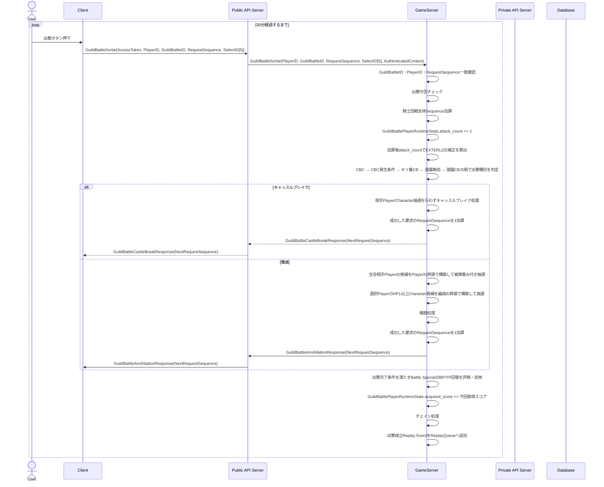

#### Battle Specialイベント処理

騎士団戦中は出撃判定, キャッスルブレイク判定, 戦闘開始, 迎撃, 敵全滅, スコア反映, 出撃完了の各処理で有効な`TACTICS_EFFECT_BATTLE_SPECIAL`を評価する. `TacticsBattleSpecialType`ごとの具体効果は「[タクティクス仕様](../../specification/game/tactics.md#特殊効果系列)」を正本とする. 騎士団全体効果は対象Guildの各出撃処理へ反映し, 対戦騎士団全体へのデバフは相手Guildの各出撃処理へ反映する. `bp_recovery` / `tp_recovery`を使用する効果は出撃が成功して完了した時点でTrigger条件を評価し, 条件成立時に回復する.

#### 要求処理順

GameServerが受信するあらゆる要求は先に到達した順に処理する. GameServer受信時刻が異なる要求は受信時刻の早い要求を先に処理する. GameServer上で完全に同時として扱われる要求同士の順序は処理系定義とし, 疑似乱数による順序決定は行わない.

出撃要求についても同じ規則を使用する. Clientは出撃要求送信後から処理結果応答受信まで通信中として追加操作送信を抑止するため, GameServer側に出撃処理中・処理待ちを表す独立状態は持たせない.

#### ログ・Metric

騎士団戦のログ・Metric・Trace処理は「[ログ仕様](../system/log.md)」に従う.
正常に成立した各操作は状態反映および`RequestSequence`更新後にReplay EventをReplayQueueへ追加する. Replay Workerによるファイル書き込み・Private API Server送信・Database保存は要求処理スレッドと非同期に行う.
正常なゲームルール拒否は要求単位のApplication Logへ出力せずMetricへ集約する. `RequestSequence`不一致, 不正CharacterID, 不正TacticsID等は要求ごとに同期ログ出力せずMemory上で集約する.

#### 再接続・状態復元

`GetGuildBattleStatus`は再接続用の状態復元APIとして扱う.
ClientはAccessToken, PlayerID, GuildBattleIDだけを送信し, GameServerは現在のRequestSequenceを要求しない.
GameServerは現在HP, BP, TP, `HealState`, `ReviveState`と残り時間, 出撃待機時間, `TacticsActiveEffectState`, アイテム残数, 両騎士団スコア, チェイン, `GuildBattleCbcStatus`, 現在RequestSequenceを返す.
`GetGuildBattleStatus`の実行ではRequestSequenceを加算しない.
CharacterID, Follower, MainSkill, Ability, FormationID等の静的な編成構成はClientが編成確定時からローカルに保持する. `JoinGuildBattle`時にServer編成と照合し, 不一致の場合はServer編成でローカル情報を上書きする. 再接続時は照合済みのローカル情報から復元する. `GetGuildBattleStatus`では静的な編成構成を再送しない.

##### タクティクス使用時

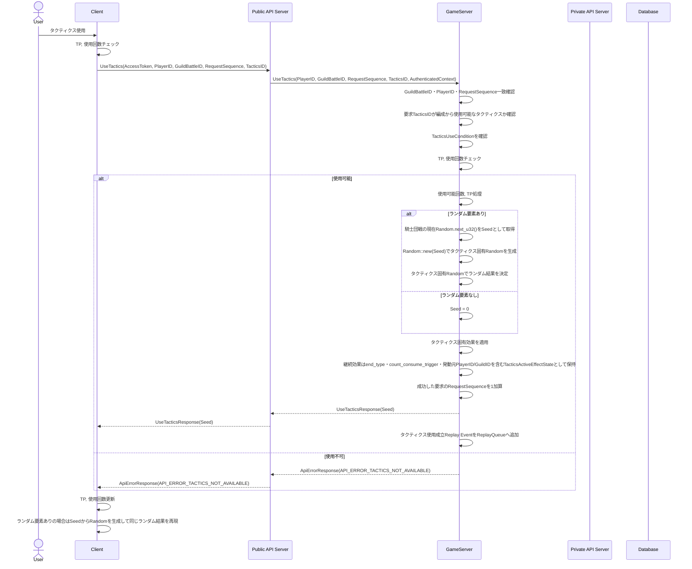

継続効果を生成する場合は`TacticsActiveEffectState.source_player_id`へ使用者PlayerID, `source_guild_id`へ使用成立時点の所属GuildIDを保存し, `TacticsTarget`の相対対象解決に使用する.

`TACTICS_USE_CONDITION_ALL_ANNIHILATED`を満たさない要求は`API_ERROR_TACTICS_NOT_AVAILABLE`として拒否し, TP・使用可能回数・RequestSequenceを変更しない. `REVIVE` / `RESURRECTION`は対象キャラクターを`FormationSlotID`（編成ID）の小さい順に並べ, その順序でタクティクス固有Randomを用いて1回ずつ確率判定する.

##### 回復アイテム使用時

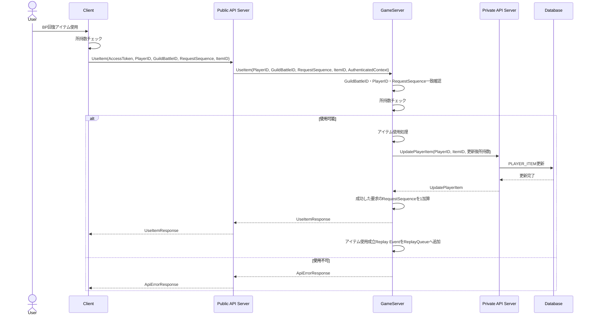

##### 治療時

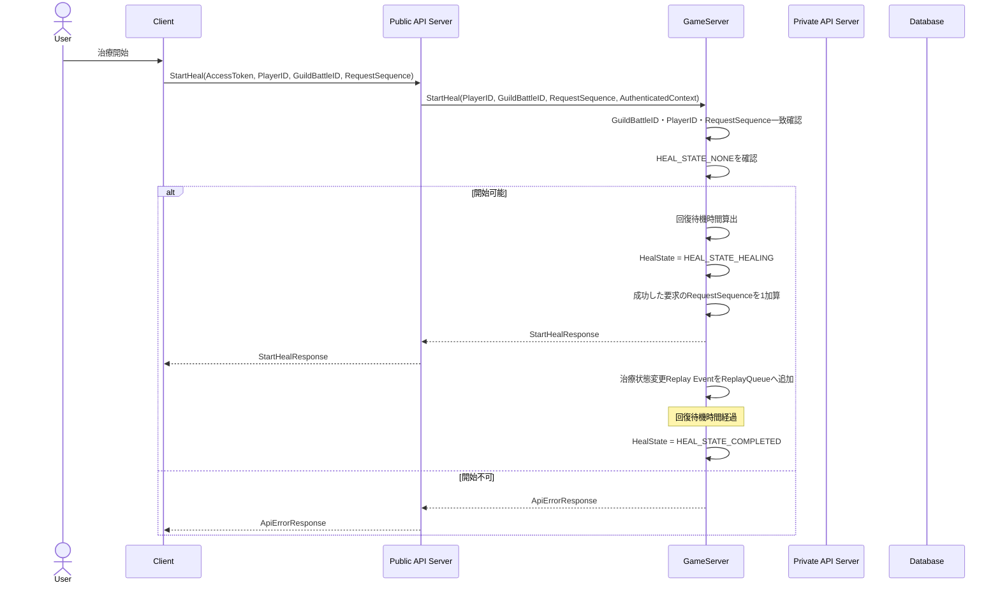

##### 治療キャンセル

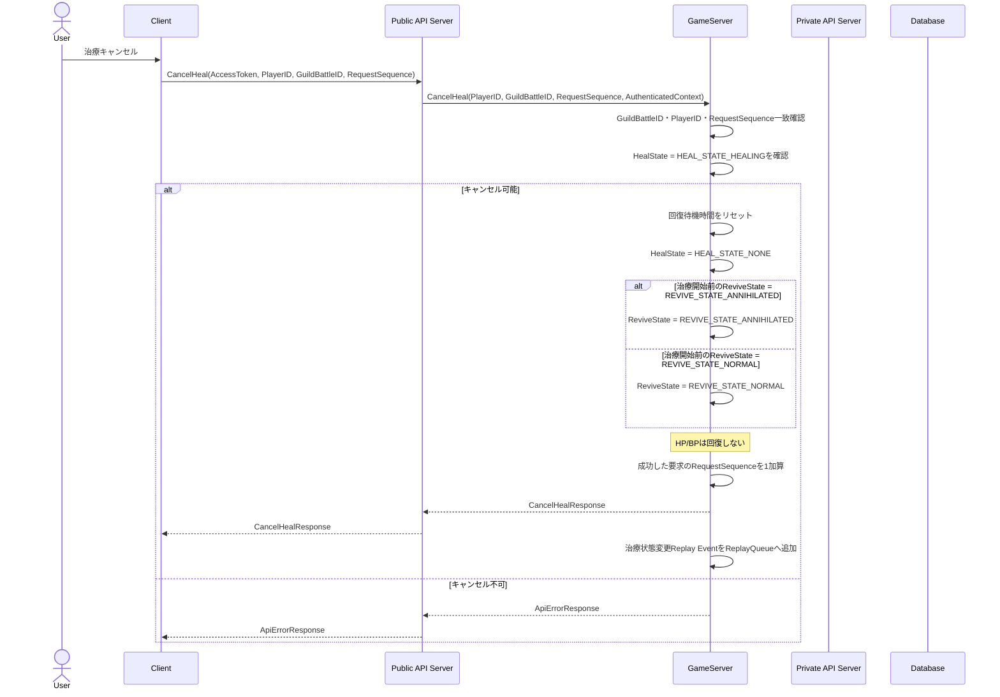

##### 治療完了状態解除

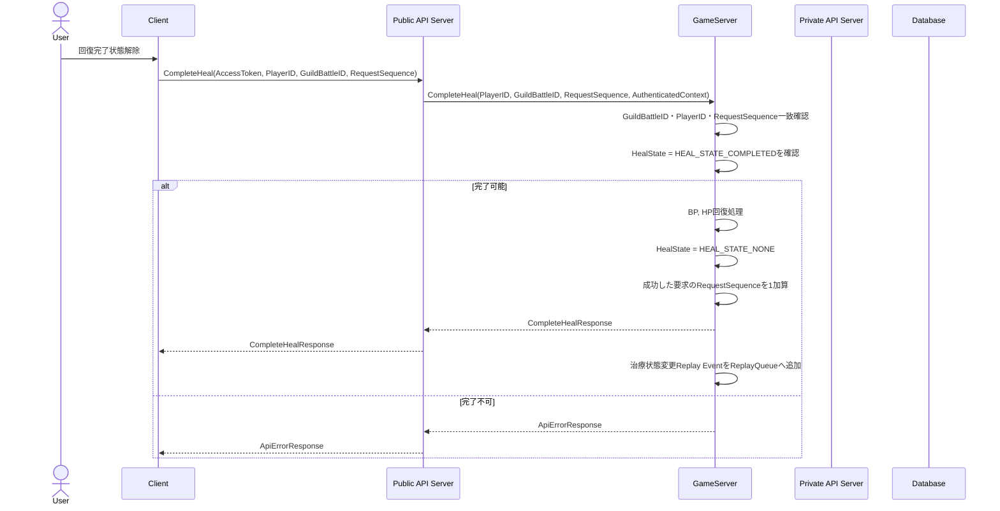

##### 復活

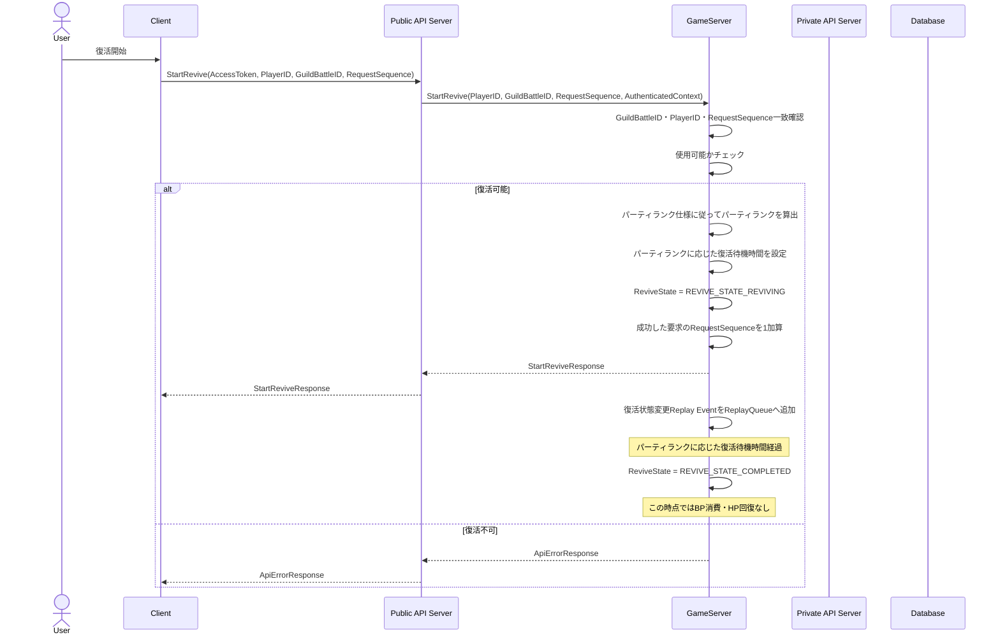

##### 復活キャンセル

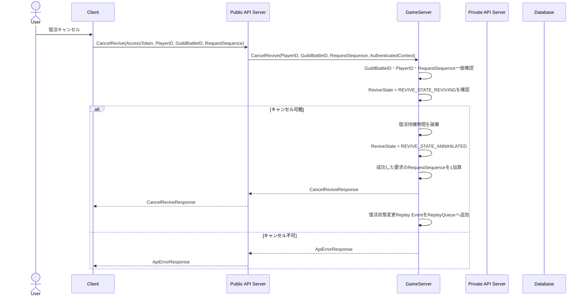

##### 復活完了状態解除

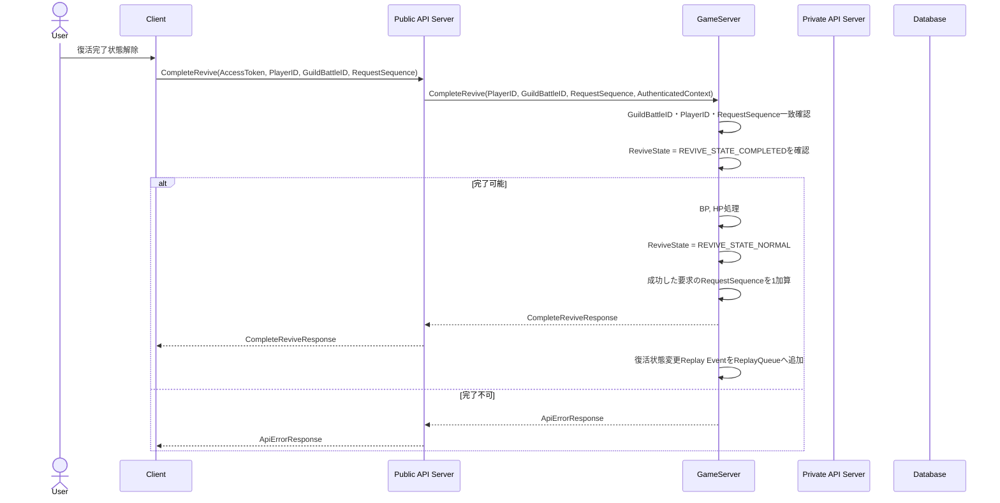

### Database送信失敗時

騎士団戦中にDatabaseへの送信が失敗した場合は, 同一送信を1回だけ再試行する. Replay Workerによるリプレイログ送信も同じ規則を使用する. 再試行も失敗した場合, GameServerは当該騎士団戦についてDB障害発生状態へ移行する.

DB障害発生状態では, それ以降の騎士団戦中Database送信を行わず, 本来送信するデータをGameServerローカルのファイルへ保存する. Replay EventのRecovery保存はReplay Worker側で行い, 騎士団戦処理スレッドはファイルI/O完了を待機しない.
保存形式はUTF-8 JSONとし, 保存先は`/var/lib/game-server/recovery`とする. 本番Kubernetes環境では同PathをGameServer専用Persistent Volumeへmountする.
ファイル名は`guild_battle_<GuildBattleID>_<GameServerInstanceID>.json`とし, 各送信予定データについてPrivate API名, `X-Operation-ID`, 要求Payload, 保存順序を保持する.
ローカルファイルはGameServer再起動後も保持する.
騎士団戦終了時およびGameServer起動時にローカル保存データを保存順にDatabaseへ再送する.
再送中に1件でも失敗した場合はローカルファイルを残し, 全件の再送に成功した場合だけ対応するローカルファイルを削除する.

騎士団戦最終結果の保存は下記終了シーケンスの専用規則を使用する.

#### 騎士団戦終了時

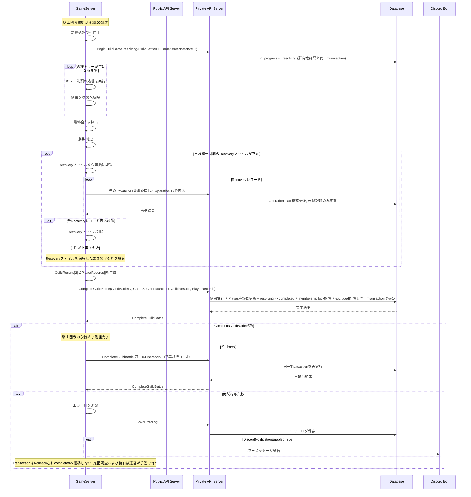

