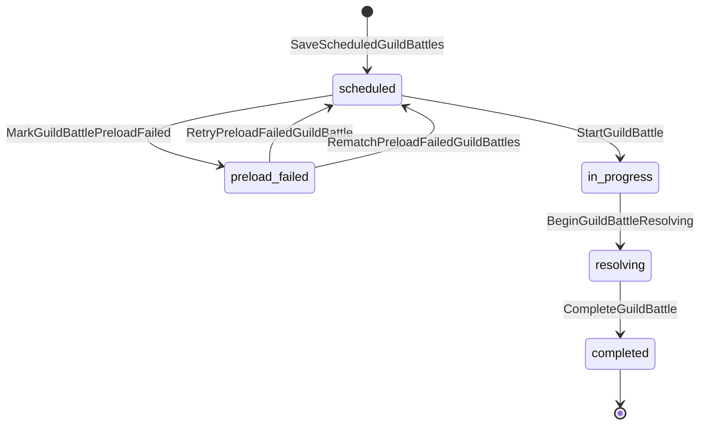

# 騎士団戦永続ライフサイクル

本書はDatabaseに保存する`GUILD_BATTLE.status`の状態遷移と, 遷移に伴う永続更新の責務境界を定義する.
ゲーム中のメモリ状態および戦闘計算はGameServerが正本とし, Database上の永続ライフサイクルはPrivate API Server内の`GuildBattleLifecycleService`を正本とする.

## 責務

* GameServer, GuildBattleCoordinatorおよび運営Componentは`GUILD_BATTLE.status`を任意値へ直接更新しない.
* Private API Serverは汎用status setterを公開せず, 意味のあるLifecycle APIだけを公開する.
* 各Lifecycle APIは現在status, `game_server_instance_id`, 必要な前提データを同一Databaseトランザクション内で再確認する.
* GameServer所有権を必要とするLifecycle APIでは, 要求`GameServerInstanceID`が`GUILD_BATTLE.game_server_instance_id`と一致することを確認する.
* 許可されていない遷移は更新せずエラーとする.
* 同一論理操作の再送は`X-Operation-ID`による冪等性を適用する. 既に同一Operation IDで成功済みの場合は更新を再適用せず初回成功時レスポンスを返す.

## 状態遷移

| 遷移元 | 遷移先 | Lifecycle API | 主な呼び出し元 | 主な保証 |
|---|---|---|---|---|
| `scheduled` | `preload_failed` | `MarkGuildBattlePreloadFailed` | 所有GameServer | 所有権一致, `initial_seed`未保存 |
| `scheduled` | `in_progress` | `StartGuildBattle` | 所有GameServer | InitialSeed保存, Create Replay保存, status更新を同一トランザクションで実行 |
| `preload_failed` | `scheduled` | `RetryPreloadFailedGuildBattle` | 運営Component | 同一ペア維持, `initial_seed=NULL`, 未割当へ戻す |
| `preload_failed` | `scheduled` | `RematchPreloadFailedGuildBattles` | GuildBattleCoordinator | 再抽選済みペア保存, `initial_seed=NULL`, 未割当へ戻す |
| `in_progress` | `resolving` | `BeginGuildBattleResolving` | 所有GameServer | 所有権一致 |
| `resolving` | `completed` | `CompleteGuildBattle` | 所有GameServer | 最終結果, Player勝敗数, status, membership lock解除, 除外一覧削除を同一トランザクションで確定 |

`scheduled`かつ未割当の騎士団戦削除は状態遷移ではなく`DeleteUnassignedGuildBattles`で行う.

## 開戦遷移

`StartGuildBattle`は以下を同一Databaseトランザクションで実行する.

1. 対象`GuildBattleID`が存在し, `status=scheduled`であることを確認する.
2. `game_server_instance_id`が要求`GameServerInstanceID`と一致することを確認する.
3. 要求`GuildID[2]`がDatabase上の`guild_a_id` / `guild_b_id`と一致することを確認する.
4. `initial_seed`がNULLであることを確認して要求`InitialSeed`を保存する.
5. `GuildBattleCreateLogPayload`をReplay作成ログとして保存する.
6. `status=in_progress`へ更新する.

InitialSeedだけ保存済み, Create Replayだけ保存済み, `in_progress`だけ更新済みという中間状態を作らない.

## 終了遷移

`CompleteGuildBattle`は以下を同一Databaseトランザクションで実行する.

1. 対象`GuildBattleID`が存在し, `status=resolving`であることを確認する.
2. `game_server_instance_id`が要求`GameServerInstanceID`と一致することを確認する.
3. `GuildResults`がDatabase上の対戦2Guildと一対一で一致し, 勝敗組み合わせが最終Scoreと整合することを確認する. Scoreが異なる場合は高い側`WIN`・低い側`LOSE`, 同値の場合は両側`DRAW`だけを許可する.
4. 2Guildの最終スコア・勝敗を`GUILD_BATTLE_RESULT`へ保存する.
5. `PlayerRecords`のPlayerID重複を拒否する. PlayerID `0`以外は対戦2Guildのいずれかへの所属を確認し, 指定Resultが所属Guildの最終結果と一致することを確認した上で, 勝利なら`guild_battle_win_count+1`, 敗北なら`guild_battle_lose_count+1`, 引き分けなら更新なしとする.
6. `status=completed`へ更新する.
7. 対戦2Guildの`GUILD.membership_locked=false`へ更新する. 複数Guildを更新する場合はGuildID昇順でLock・更新する.
8. 対象対戦の`start_at`から対象日・開始時刻を求め, 同時間帯の`GUILD_BATTLE_EXCLUDED_GUILD`に保存されたGuildもGuildID昇順で`membership_locked=false`へ更新する.
9. 対応する`GUILD_BATTLE_EXCLUDED_GUILD`を削除する.

最終結果保存, Player勝敗数更新, `completed`遷移, membership lock解除の一部だけが確定した中間状態を作らない.

`CompleteGuildBattle`は通常の騎士団戦中DB送信障害ルールとは別の専用失敗処理を使用する. 初回失敗後に同一`X-Operation-ID`で1回だけ再試行し, 再試行も失敗した場合はError Logを保存し, `DiscordNotificationEnabled=true`の場合はDiscord Botへ通知して運営による手動復旧対象とする. 失敗時はDatabaseトランザクションをRollbackするため`completed`へ遷移しない.

## Preload失敗

`MarkGuildBattlePreloadFailed`は`scheduled -> preload_failed`だけを許可する. 所有GameServerが変わっている場合は更新しない.
`preload_failed`では対戦Guildのmembership lockを維持し, 運営による同一ペア再開, 再抽選, 中止判断を待つ.

同一ペア再開および再抽選は既存仕様どおり`RetryPreloadFailedGuildBattle`と`RematchPreloadFailedGuildBattles`を使用する. いずれも`preload_failed`以外から`scheduled`へ戻さない.
