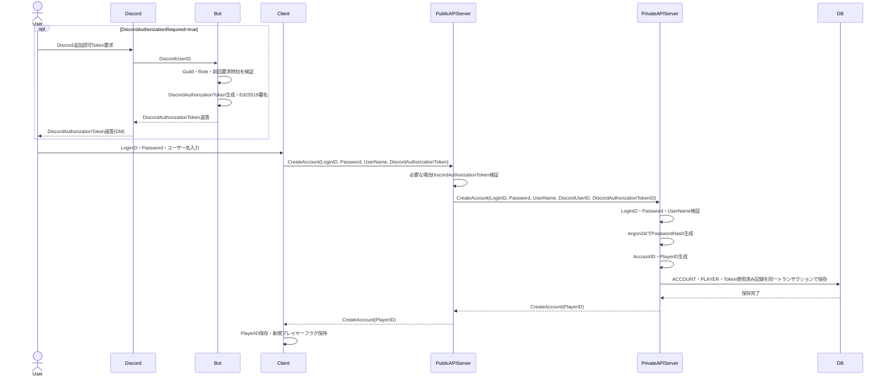
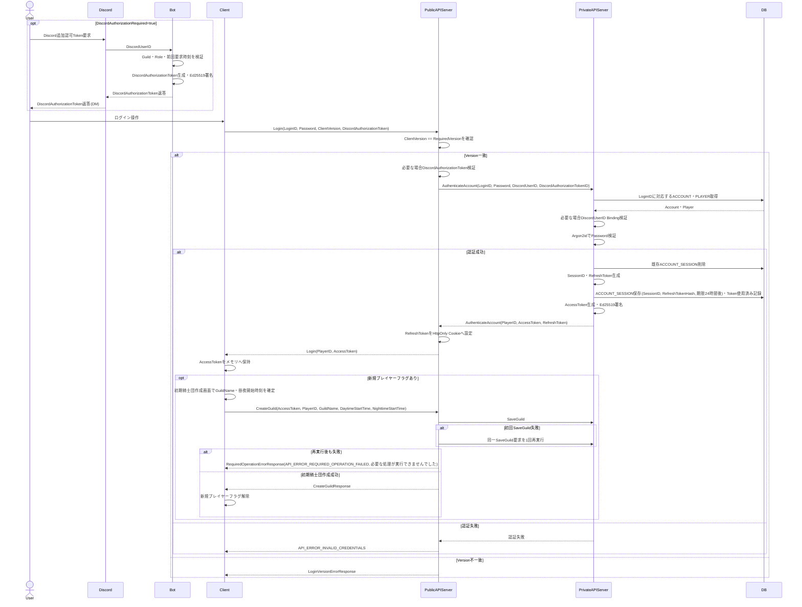
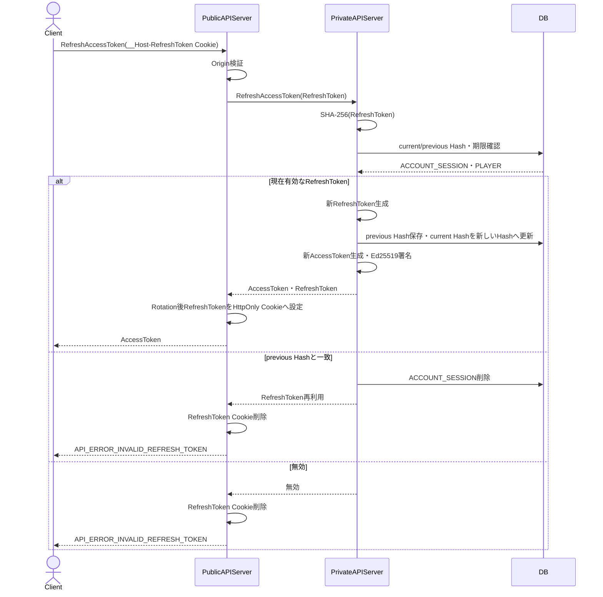
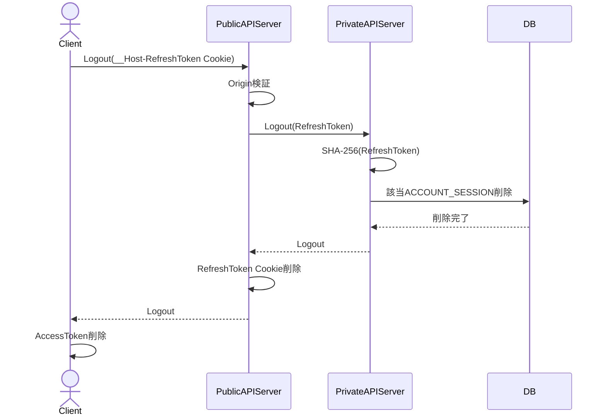

# セッション仕様

* Accountの本人認証は`LoginID`と`Password`を使用する.
* Discord Bot連携はOptionとし, Accountの本人認証方式そのものには使用しない.
* Discord Bot連携では運営通知とDiscordロールによる追加認可を行う. 2つの機能は個別に有効・無効を設定可能とする.
* `DiscordAuthorizationRequired=true`の場合, Account新規作成およびLoginにはDiscord Botが発行した`DiscordAuthorizationToken`を必須とする. 現在の運用では`DiscordAuthorizationRequired=true`とする.
* `DiscordAuthorizationRequired=false`の場合, Discord Botを導入せずにAccount新規作成およびLoginを行える.
* `DiscordAuthorizationRequired=true`で作成したAccountは`DiscordAuthorizationToken.sub`のDiscordUserIDをAccountへBindingし, Login時は同一DiscordUserIDのTokenだけを許可する.
* `DiscordNotificationEnabled=true`の場合, GameServer, GuildBattleCoordinatorおよびPrivate API Serverから運営向け通知をDiscord Botへ送信する. `false`の場合はBot通知を行わず, ErrorLog等の既存処理だけを行う.
* `ACCOUNT`と`PLAYER`は分離し, 認証主体を`ACCOUNT`, ゲーム上の主体を`PLAYER`とする.
* 1つのAccountに同時に保持できる有効なRefresh Sessionは1つだけとする.
* 新規Login成功時は既存Refresh Sessionを無効化してから新しいSessionを作成する.
* AccessTokenは短寿命の署名付きTokenとし, 通常PublicAPIの認証に使用する.
* RefreshTokenはAccessToken更新専用の長寿命Tokenとし, 通常のゲームAPIには使用しない.
* AccessTokenはClientのプロセスメモリ上だけに保持し, OPFS, LocalStorage, IndexedDB等の永続Client Storageへ保存しない.
* RefreshTokenはClient JavaScriptから参照可能なStorageへ保存せず, Public API Serverが`__Host-RefreshToken` Cookieとして設定する.
  - `Secure`を必須とする.
  - `HttpOnly`を必須とする.
  - `SameSite=Strict`とする.
  - `Path=/`とする.
  - `Domain`属性を指定しない.
  - Cookieの`Expires`または`Max-Age`は対応するRefresh Sessionの期限を超えない.
* Refresh Sessionの期限はLogin成功時刻から24時間後とし, Login後に延長しない.
* AccessTokenの期限は5分とする.
* 新規Login, Logout, Discord Role喪失またはRefreshToken再利用検知でRefresh Sessionを無効化した場合でも, 既に発行済みのAccessTokenは自身の`exp`到達まで最大5分間有効とする. AccessTokenごとの失効確認のためにPublicAPIからDatabaseへ問い合わせる方式とはしない.

## Discord Bot設定

| 設定 | 内容 | 現在の運用値 |
|---|---|---|
| `DiscordAuthorizationRequired` | Account新規作成およびLoginでDiscordロール追加認可を必須とするか | `true` |
| `DiscordNotificationEnabled` | 運営向け通知をDiscord Botへ送信するか | `true` |
| `DiscordGuildID` | 追加認可でRole確認対象とするDiscord Guild | 運用設定で指定する |
| `DiscordRequiredRoleID` | 追加認可で保持を必須とするDiscord Role | 運用設定で指定する |

* `DiscordAuthorizationRequired=false`の場合, `DiscordGuildID`および`DiscordRequiredRoleID`を追加認可には使用しない.
* `DiscordAuthorizationRequired=true`の場合, Discord Botを使用せずに新規Account作成または新規Loginを成功させる経路を設けない.
* `DiscordNotificationEnabled=false`の場合, 通知先Botが存在しないことをエラーとしてゲーム処理へ反映しない.

## Discord Bot追加認可

* Discord Botは設定されたDiscord Guild内で要求元DiscordUserIDが設定されたRoleを保持していることを確認する.
* Bot側のToken発行要求は, 同一DiscordUserIDについて前回要求時から5分以上経過している場合だけ許可する.
* Role確認成功後, Botは`DiscordAuthorizationToken`を生成し, Botが保持するEd25519秘密鍵で署名する.
* `DiscordAuthorizationToken`の有効期限は発行時刻から5分とする.
* `DiscordAuthorizationToken`はJWT Compact Serializationを使用し, AccessTokenとは別の署名鍵を使用する. Discord追加認可Token署名用秘密鍵はBotだけが保持し, Public API Serverは検証用公開鍵だけを保持する.
* `DiscordAuthorizationToken`には以下Claimを含める.
  - `iss`: Discord追加認可Token発行元を識別する固定値.
  - `aud`: `game-discord-authorization`.
  - `sub`: `DiscordUserID`を10進文字列化した値.
  - `jti`: Tokenごとに暗号学的乱数で生成する128bitの`DiscordAuthorizationTokenID`をcanonical UUID文字列で表した値.
  - `iat`: 発行時刻.
  - `exp`: 有効期限.
* Public API Serverは`DiscordAuthorizationRequired=true`の場合, `CreateAccount`および`Login`の処理前に`DiscordAuthorizationToken`について以下をすべて検証する.
  - JWT構文が正しい.
  - `alg=EdDSA`である.
  - Discord追加認可Token検証用公開鍵で署名を正常に検証できる.
  - `iss`がDiscord追加認可Token用設定値と一致する.
  - `aud=game-discord-authorization`である.
  - 現在時刻が`exp`未満である.
  - `jti`が予約済み無効値ではない.
* Public API Serverは検証成功後に`sub`のDiscordUserIDと`jti`をPrivate API Serverへ中継する.
* Private API ServerはAccount新規作成またはLogin成功時に`jti`を使用済みとしてDatabaseへ保存する. 既に使用済みの`jti`では処理を成功させない.
* `DiscordAuthorizationRequired=true`でAccountを新規作成する場合, `sub`のDiscordUserIDを`ACCOUNT.discord_user_id`へ保存する.
* `DiscordAuthorizationRequired=true`でLoginする場合, `sub`のDiscordUserIDと`ACCOUNT.discord_user_id`が一致することを必須とする. 不一致時はAccount認証を成功させない.
* Discord Botが対象DiscordUserIDについて必要Roleを保持しなくなったことを検出した場合, mTLSでPrivate API Serverの`RevokeDiscordSessions`を要求し, 当該DiscordUserIDへBindingされたAccountの`ACCOUNT_SESSION`を削除する.
* `RefreshAccessToken`ではDiscord APIへのRole問い合わせを行わない. Role喪失はBotからのSession失効と24時間のRefresh Session期限で反映し, 通常ゲームAPIのHot PathへDiscord API通信を追加しない.
* Discord Bot連携用のGuild ID, Role ID, Bot Token, Bot通知用mTLS秘密鍵およびDiscord追加認可Token署名用秘密鍵をソースコードまたは公開リポジトリへ保存しない.

## LoginID

* LoginIDは3文字以上64文字以下とする.
* 使用可能文字はASCII英数字, `.`, `_`, `-`だけとする.
* LoginIDは大文字小文字を区別する.
* LoginIDはDatabase上で一意とする.

## Password

* Passwordは平文でDatabaseへ保存しない.
* PasswordはPrivate API ServerでArgon2idを使用してPasswordHashへ変換して保存する.
* Passwordごとに16byte以上の暗号学的乱数Saltを生成する. PasswordHashはArgon2idのパラメータ, Salt, Hashを含む形式で保存する.
* Argon2idの最低パラメータは以下とする.
  - memory: 19456 KiB.
  - iterations: 2.
  - parallelism: 1.
* 実運用では上記を下回らない範囲で対象Server上の計測結果に応じて引き上げることを許可する.
* Passwordの最小長は15文字, 最大長は128文字とする.
* Passwordへ文字種の組み合わせ規則を設けない.
* PasswordをApplication Log, Access Log, Traceへ出力しない.
* Private API ServerはArgon2id処理を認証専用の同時実行制限対象とし, ゲームデータ処理用の処理枠をArgon2id処理で占有しない.
* Argon2idの最大同時実行数は運用設定とし, 推奨初期値を2とする. 対象Server上のCPU・Memory計測値に応じて変更できるが, 無制限にはしない.

## AccessToken

* AccessTokenはJWT Compact Serializationを使用する.
* AccessTokenの署名アルゴリズムはEd25519を使用し, JOSE上の`alg`は`EdDSA`に固定する.
* Private API Serverだけが署名用秘密鍵を保持する.
* Public API Serverは検証用公開鍵を保持し, AccessToken検証時にPrivate API ServerまたはDatabaseへ問い合わせない.
* AccessTokenにはwire上の有限の最大長を設定し, 上限超過時はJWT構文解析および署名検証前に拒否する. 最大長は定義済みClaimと設定値から生成される正規Tokenを格納可能な値として設定し, 無制限にはしない.
* AccessTokenには以下Claimを含める.
  - `iss`: Token発行元を識別する固定値.
  - `aud`: `game-api`.
  - `sub`: `AccountID`を10進文字列化した値.
  - `player_id`: `PlayerID`.
  - `sid`: `SessionID`.
  - `iat`: 発行時刻.
  - `exp`: 有効期限.
* Public API ServerはAccessTokenについて以下をすべて検証する.
  - JWT構文が正しい.
  - `alg=EdDSA`である.
  - 署名が検証用公開鍵で正常に検証できる.
  - `iss`が設定値と一致する.
  - `aud=game-api`である.
  - 現在時刻が`exp`未満である.
  - `player_id`が要求`PlayerID`と一致する.
* 検証成功後, Public API Serverは`AccountID`, `PlayerID`, `SessionID`から`AuthenticatedContext`を生成し, mTLS接続上でGameServerへ要求と共に中継する.
* Clientから受信した`AuthenticatedContext`を使用しない.

## RefreshToken

* RefreshTokenは32byteの暗号学的乱数で生成する.
* Public API ServerがRefreshTokenをCookieへ格納する場合は32byte値をBase64url without paddingでencodeし, Cookieから取得した値はdecodeしてからPrivate API Serverへ渡す. 不正なencodingはPrivate API Serverへ中継せず無効なRefreshTokenとして扱う.
* DatabaseへRefreshTokenの平文を保存しない.
* Databaseへは`SHA-256(RefreshToken)`を`refresh_token_hash`として保存する.
* RefreshToken更新成功時は新しいRefreshTokenを生成し, 更新前の`refresh_token_hash`を`previous_refresh_token_hash`へ移動してから新しいHashを`refresh_token_hash`へ保存する.
* 同一RefreshTokenによる更新要求が同時に到達した場合でも成功する要求は1つだけとし, 検証とHash置換を同一トランザクション内で排他的に行う.
* 受信RefreshTokenのHashが`previous_refresh_token_hash`と一致した場合はRefreshToken再利用として扱い, 対象`ACCOUNT_SESSION`を削除する. 新しいAccessTokenまたはRefreshTokenを発行しない.
* RefreshTokenの期限は対応するRefresh Sessionの期限と同一とし, Login成功時刻から24時間後を超えて更新しない.

## アカウント新規作成

* `LoginID`はDatabase上で一意とする.
* `UserName`は既存のPlayerユーザー名制約に従う.
* `DiscordAuthorizationRequired=true`の場合はAccountへDiscordUserIDをBindingし, `DiscordAuthorizationTokenID`を使用済みとして保存する.
* Account作成, Player作成およびDiscord追加認可Token使用済み記録は同一トランザクションで行う.
* AccountIDおよびPlayerIDは予約済み無効値を生成しない.
* LoginID重複による作成失敗はClientへ既存LoginIDの存在を明示せず`API_ERROR_ACCOUNT_CREATION_FAILED`として返す.

## ログイン

* Public API Serverは現在要求する`Version`を保持し, Login時に`LoginRequest.ClientVersion`との一致を検証する.
* `DiscordAuthorizationRequired=true`の場合, Discord追加認可Tokenの未指定は`API_ERROR_DISCORD_AUTHORIZATION_REQUIRED`, 不正, 期限切れまたは使用済みは`API_ERROR_INVALID_DISCORD_AUTHORIZATION_TOKEN`として返す.
* LoginID不存在, Password不一致およびDiscordUserID Binding不一致はClientへ同一の`API_ERROR_INVALID_CREDENTIALS`として返す.
* Login成功時に既存`ACCOUNT_SESSION`を削除してから新しいSessionを保存する.
* Login成功後, 旧RefreshTokenは使用できない.
* 旧AccessTokenは自身の`exp`到達まで最大5分間有効である.

## AccessToken更新

* RefreshToken更新ではRefresh Sessionの24時間期限を延長しない.
* `RefreshAccessToken`は設定済みClient Originと`Origin` Headerが一致する要求だけを処理する.

## Logout

* `Logout`は設定済みClient Originと`Origin` Headerが一致する要求だけを処理する.
* Logout後も既に発行済みのAccessTokenは自身の`exp`到達まで最大5分間有効とする.

## 騎士団戦参加時のSession確認

* Public API ServerはAccessToken検証後に`AuthenticatedContext`をGameServerへ渡す.
* GameServerは騎士団戦参加条件を満たした場合, `AuthenticatedContext.SessionID`を使用してPrivate APIの`ValidateAccountSession`を要求する.
* `ACCOUNT_SESSION`が存在しない, またはLogin成功時刻から24時間の期限を過ぎている場合は騎士団戦へ参加させない.
* 本処理ではRefresh Sessionの期限を延長しない.
