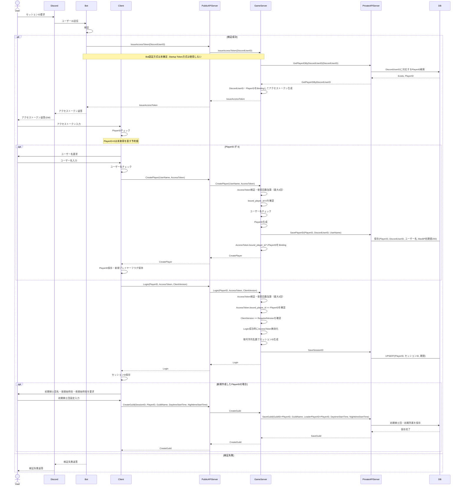
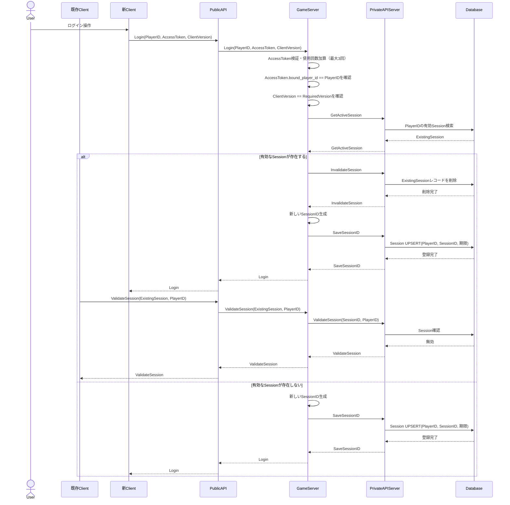

# セッション仕様

* 複数端末からのアクセスは不可とする.
* OPFS上に保存される.
* セッションIDの期限は72時間とする.
  - 以下アクション時に期限がリセットされる.
    - ログイン時.
    - 騎士団戦参加時.

### セッションID新規取得

GameServer起動引数へStartup Tokenを渡す方式は廃止する. BotからPublicAPIの`IssueAccessToken`を呼び出すための代替認証方式は未確定であり, 本書では定義しない.
Bot側のユーザー検証は特定のロールを持っているか, 前回要求時から5分以上経過しているかを確認する.
アクセストークンの期限は5分とし, Login成功前に検証成功できる回数は最大3回とする.
AccessTokenはDiscord User IDとPlayerIDを結び付けて保持し, 別PlayerIDのLoginへ流用できない.
アクセストークンおよびセッションIDの型は「[型定義](types.md)」を参照する.

#### 複数端末ログイン時

## AccessToken Binding・利用回数

* GameServerはAccessTokenを`AccessTokenState`としてメモリ上に保持し, DiscordUserID, Binding済みPlayerID, 有効期限, 使用回数を保持する.
* 既存Playerの場合, `IssueAccessToken`時にDiscordUserIDから取得したPlayerIDへBindingする.
* 新規Playerの場合, 発行時のBinding済みPlayerIDは予約値0とし, `CreatePlayer`成功時に生成PlayerIDへBindingする.
* AccessToken検証前に使用回数が3以上なら拒否し, 検証成功時に使用回数を1加算する. Login成功前に検証成功できる回数は最大3回とする.
* Loginでは要求PlayerIDとBinding済みPlayerIDが一致しなければ拒否する.
* Login成功時はAccessTokenを無効化する.

## Login時Version検証

* Clientは`LoginRequest.ClientVersion`へ現在使用している`Version`を設定する.
* GameServerはLogin時にClientVersionと要求Versionを比較する.
* 不一致の場合はSessionを発行せず, `LoginVersionErrorResponse`で`API_ERROR_CLIENT_VERSION_MISMATCH`と`RequiredVersion`を返す.
* ClientはVersion不一致レスポンスを受け取った場合, 必要Versionへの更新をユーザーへ促す.

## SessionID生成規則

* SessionIDは暗号学的乱数で生成する.
* Databaseの`PLAYER_SESSION.session_id` UNIQUE制約に衝突した場合, Private APIは`SaveSessionIDErrorResponse`で`SAVE_SESSION_ID_ERROR_SESSION_ID_CONFLICT`を返す. GameServerはSessionIDを再生成して`SaveSessionID`を再実行する.
* `SaveSessionID`はPlayerIDを競合キーとしたUPSERTとする.

## PublicAPIでのSession検証

SessionIDを要求するPublicAPIは, 要求本体を処理する前に以下をすべて検証する.

* Sessionレコードが存在する.
* Sessionが有効期限内である.
* SessionIDが要求PlayerIDに所有されている.
