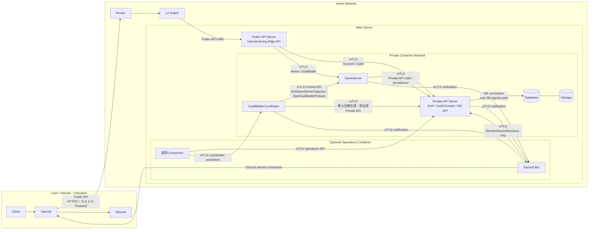
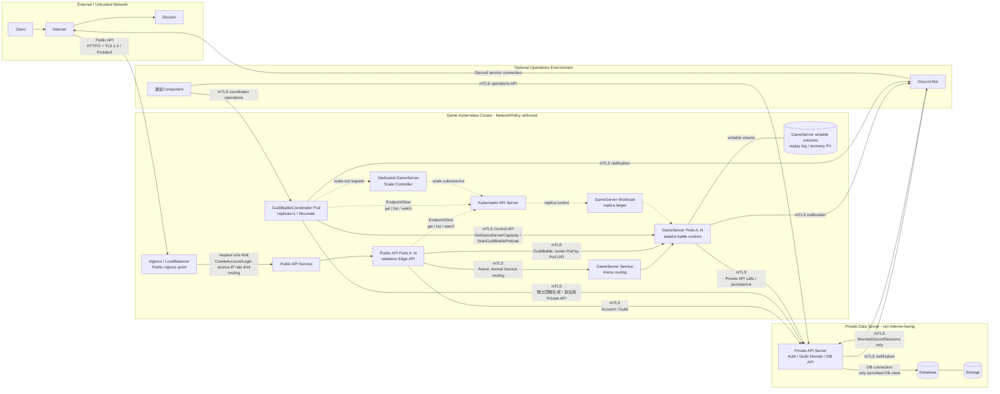

## ネットワーク図

### テスト環境

### 通信暗号化要件

* ClientとPublic API Server間のPublic API transportはHTTP/2 over TLS 1.3とし, API PayloadはProtocol Buffersを使用する. Public API Payloadのwire schemaは「[public_api.proto](public_api.proto)」を正とする.
* ClientとPublic API Server間の通信はTLS 1.3を必須とする. `LoginID`, `Password`, `AccessToken`, `RefreshToken`, `DiscordAuthorizationToken`を平文transportで送信しない.
* Public API Serverは接続を可能な限り再利用し, API要求ごとにTLS接続を新規作成する方式とはしない.
* RefreshTokenは`Secure`, `HttpOnly`, `SameSite=Strict`, `Path=/`, Domain属性なしの`__Host-RefreshToken` CookieだけでClientへ保持させる. Response BodyへRefreshTokenを返さない.
* `RefreshAccessToken`および`Logout`では設定済みClient Originと`Origin` Headerの一致をPublic API Serverで確認する. CORSを使用する構成ではCredential許可Originを設定済みClient Originだけに限定し, wildcardを使用しない.
* Public API Request Bodyには有限の最大サイズを設定し, IngressとPublic API Serverの双方で上限を適用する. 最大サイズは各Public API Payloadについて仕様上取り得る最大serialization sizeを満たす値として設定し, 無制限にはしない.
* `AccessToken`および`DiscordAuthorizationToken`にもwire上の有限の最大長を設定し, JWT構文解析および署名検証より前に上限超過を拒否する. 最大長は定義済みClaimと設定値から生成される正規Tokenを格納可能な値として設定し, 無制限にはしない.
* Public API ServerとGameServer間の通信はmTLSを必須とする. 双方は信頼済みCAによる相手証明書を検証し, 証明書検証に失敗した接続を受け付けない.
* Public API ServerとPrivate API Server間の通信はmTLSを必須とする. 双方は信頼済みCAによる相手証明書を検証し, 証明書検証に失敗した接続を受け付けない. Account/Guild系Public APIは本経路でPrivate API Serverへ直接中継する.
* GameServerとPrivate API Server間の通信はmTLSを必須とする. 双方は信頼済みCAによる相手証明書を検証し, 証明書検証に失敗した接続を受け付けない.
* GuildBattleCoordinatorとGameServer間のControl API通信はmTLSを必須とする. GameServerはGuildBattleCoordinatorのService Identityから`GetGameServerCapacity`および`StartGuildBattlePreload`だけを受け付ける.
* GuildBattleCoordinatorとPrivate API Server間の通信はmTLSを必須とする. Private API ServerはGuildBattleCoordinatorのService Identityに対して騎士団戦生成・割当・再抽選に必要なPrivate APIだけを許可する.
* 運営ComponentからPrivate API Serverへの運用API通信はmTLSを必須とする. Private API Serverは運営用Service Identityを検証し, 運営API以外を許可しない.
* 運営ComponentからGuildBattleCoordinatorへのCoordinator固有運用API通信もmTLSを必須とし, GuildBattleCoordinatorは運営用Service Identityから許可した運用操作だけを受け付ける.
* `DiscordNotificationEnabled=true`の場合, GameServer, GuildBattleCoordinatorまたはPrivate API ServerからDiscord Botへ送信する運営通知通信はmTLSを必須とする. Discord Botは通知送信元のService Identityを検証する.
* `DiscordAuthorizationRequired=true`の場合, Discord BotからPrivate API Serverの`RevokeDiscordSessions`へ送信するRole喪失通知もmTLSを必須とする. Private API ServerはDiscord BotのService Identityを検証し, Discord Botから他のPrivate APIを受け付けない.
* mTLS証明書はPublic API Server, GameServer, GuildBattleCoordinator, Private API Server, Discord Botおよび運営Componentを識別可能なService Identityを持つ. 接続先Serverは証明書のService Identityに基づき呼び出し可能なAPIを制限する.
* Private Network内からの接続であっても到達可能性だけを認証根拠としない. Public API Server, GameServer, GuildBattleCoordinator, Private API Server, Discord Botおよび運営Component間の内部Requestは, mTLSで検証したService Identityと許可済みAPIの組み合わせが一致する場合だけ受け付ける.
* Public API ServerがAccessTokenを検証済みであっても, Private API ServerおよびGameServerはPublic API ServerによるDomain認可結果を信頼しない. Private API ServerはDatabase上の現在状態からAccount/Guildの認可と不変条件を再評価し, GameServerは自身が所有する現在ゲーム状態からArena/GuildBattleの操作可否と不変条件を再評価する.
* Public API ServerはClientがRequest Payloadへ指定したPlayerID等をCaller Identityとして使用せず, 検証済みAccessTokenから確定したCaller Identityを内部Request Contextへ設定する. 内部ComponentはCaller Identityと操作対象Identifierを分離して扱い, Caller Identityの上書きをClient入力から許可しない.
* Databaseへ直接接続できるのはPrivate API Serverだけとする. Public API Server, GameServerおよびGuildBattleCoordinatorからDatabaseへ直接接続しない.
* 認証用秘密鍵, Database認証情報, Discord Bot Token, TLS秘密鍵等の秘密情報をソースコードおよび公開リポジトリへ保存しない.
* AccessToken署名用秘密鍵はPrivate API Serverだけが保持する. DiscordAuthorizationToken署名用秘密鍵はDiscord Botだけが保持する. Public API Serverは各Tokenの検証用公開鍵だけを保持する.
* Discord Bot連携はOptionとする. `DiscordAuthorizationRequired`と`DiscordNotificationEnabled`は独立して設定する. 現在の運用では`DiscordAuthorizationRequired=true`とする.

### 本番環境

Public API ServerとGameServerはKubernetes上で稼働し, 負荷に応じて水平スケール可能とする.
GuildBattleCoordinatorはKubernetes上で`replicas=1`の専用Workloadとして稼働する. 更新方式は`Recreate`とし, 新旧GuildBattleCoordinatorを同時稼働させない.
Private API ServerとDatabaseはKubernetes上のPublic API Server, GameServerおよびGuildBattleCoordinatorとは分離した単一Server上で稼働する.

* Public API ServerはInternet-facing Edge APIとし, 認証状態, Guild状態およびゲーム状態を正本として保持しないstateless構成とする. Database/GameServer状態を使用するDomain ruleは判定せず, Account/Guild系はPrivate API Server, Arena/GuildBattle系はGameServerへ中継する. Podが削除されても永続状態を失わない. 詳細は「[Public API責務境界](../server/public_api_responsibility.md)」を参照する.
* GameServerは進行中のゲーム状態をメモリ上に保持するstateful構成とする. 騎士団戦は`GuildBattleCoordinator`が`GuildBattleID`単位で1つのGameServerへ割り当て, 同一騎士団戦の処理を複数GameServerで同時に行わない.
* GuildBattleCoordinatorは騎士団戦の生成・マッチング・GameServer割当・Preload開始指示だけを担当し, Clientからの通常騎士団戦要求の経路には入らない. 詳細は「[騎士団戦コーディネーター](../server/guild_battle_coordinator.md)」を参照する.
* Public API Serverは`GuildBattleID -> GameServerInstanceID`を使用して騎士団戦要求を所有GameServerへ中継する. 本番環境では`GameServerInstanceID`にKubernetes Pod UIDを使用し, Public API ServerはEndpointSliceをwatchしてPod UIDから接続先Endpointを解決する. 通常のService Load Balancingを騎士団戦要求の所有GameServer選択には使用しない. 詳細は「[ゲームサーバー](../server/game_server.md)」を参照する.
* KubernetesではNetworkPolicyを使用し, Internetから到達可能な対象をIngress/Public API Serverだけに制限する. GameServer, GuildBattleCoordinator, Private API Server, DatabaseをInternetへ直接公開しない. Discord BotはDiscordとの通信に必要な外向き通信, GameServer・GuildBattleCoordinator・Private API Serverからの運営通知受信, `DiscordAuthorizationRequired=true`時のPrivate API Server `RevokeDiscordSessions`呼び出しだけを許可する.
* Discord Botの本番配置先は本仕様では固定しない. Discordへ接続可能で, GameServer・GuildBattleCoordinator・Private API Serverからの運営通知を受信可能かつ必要時にPrivate API ServerへmTLS接続可能な運営管理下環境へ配置する.
* Public API Server, GameServerおよびGuildBattleCoordinator Podはnon-root Userで実行し, privilege escalationを禁止し, Linux Capabilityをすべてdropし, `RuntimeDefault` seccompを使用する.
* Public API Server, GameServerおよびGuildBattleCoordinator Podはroot filesystemをread-onlyとする. System/Access/Security Logは`stdout` / `stderr`へ出力し, Container RuntimeおよびNode上のログ収集Agentが非同期に収集する. 騎士団戦リプレイログ用の`./log/guild_battle`だけを必要なGameServerへ専用Writable Volumeとしてmountする. GameServerのDatabase障害時保存は`/var/lib/game-server/recovery`へmountした専用Persistent Volumeへの書き込みを許可する.
* Public API ServerのKubernetes ServiceAccountには, GameServer用EndpointSliceの`get`, `list`, `watch`に必要な最小権限だけを付与する.
* GuildBattleCoordinatorのKubernetes ServiceAccountには, GameServer用EndpointSliceの`get`, `list`, `watch`に必要な最小権限だけを付与する. `GuildBattleCoordinator`は単一Instanceで稼働するため騎士団戦生成用Leader Electionは行わない.
* GameServerは騎士団戦マッチング用Leaseを使用しない. Kubernetes APIを直接使用しないGameServerではServiceAccount Tokenを自動mountしない.
* GameServer水平スケーリングは専用Controllerを介して行う. GameServer PodおよびGuildBattleCoordinator自身へDeployment/StatefulSetのreplica変更権限を付与しない. Controllerだけに対象GameServer Workloadのscale変更に必要な最小権限を付与する. GuildBattleCoordinatorはControllerへscale outを要求する.
* Kubernetes APIを使用しないPodではServiceAccount Tokenを自動mountしない. Public API ServerおよびGuildBattleCoordinatorでも上記権限以外を付与しない.
* Kubernetes Secretへ保存するmTLS秘密鍵等はetcd Encryption at Restを有効化したClusterで管理し, Secretの参照権限を対象ServiceAccountだけに限定する.
* Public API Serverの水平スケールは通常のreplica増減を許可する. Public APIのApplication Level Rate Limitカウンタを各Podのローカルメモリだけで独立管理しない. 複数Pod間で同一カウント単位の制限結果が共有される構成とする.
* `CreateAccount`および`Login`のSource IP単位Rate LimitはIngress/Gateway等のPublic API到達前で適用し, 閾値は運用設定とする. Clientが任意指定したForwarded/X-Forwarded-For相当Headerを信頼しない.
* GameServerのscale downは進行中騎士団戦を保持していないInstanceだけを対象とする. CPU使用率だけを条件として進行中騎士団戦を保持するPodを削除しない. GuildBattleCoordinatorは`draining`状態のGameServerを新規割当候補に含めない.
* Private API ServerおよびDatabaseは単一Serverでのみ稼働するため, 本構成では単一障害点となる.
