# 騎士団戦仕様

## 事前用語説明

* 騎士団戦
  - 一般的なギルドバトルと同義.
* 騎士団
  - 一般的なギルドと同義.
  - 詳細は「[騎士団](guild.md)」を参照.
* キャラクター
  - 詳細は「[キャラクター](character.md)」を参照.
* フォーメーション
  - 詳細は「[フォーメーション](formation.md)」を参照.
* 出撃
* 殲滅
* キャッスルブレイク
  - 大幅に「pt」を獲得できる.
* タクティクス
  - 詳細は「[タクティクス](tactics.md)」を参照.
* チェイン
  - 各「騎士団」単位で保有する値
  - 値が大きくなるほど有利な補正を受ける
  - 最小値は0.
  - 「騎士団戦」開始時は0.
* pt
  - 一般的なスコアと同義.
* BP
  - 一般的なコストと同義.
  - 各プレイヤーが保有する値であり, 「出撃」及び「復活」を使用するために必要.
  - 「治療」もしくは「アイテム回復」を行うことで値を増やすことができる.
  - 最大値と現在値の2つを持つ.
    - 現在値は最大値を超えることはない.
    - ともに0未満になることはない.
  - 最大値はプレイヤーごとに異なる.
  - 「騎士団戦」開始時の現在BPは最大値と同じ.
* TP
  - 各プレイヤーが保有する値であり, 「タクティクス」を使用するために必要.
  - 「出撃」もしくは「被弾」することで値を増やすことができる.
    - 現在値は最大値を超えることはない.
    - ともに0未満になることはない.
  - 最大値は100.
  - 「騎士団戦」開始時の現在「TP」は0.


## 概要


## 勝敗条件
タイムアップ時に最も合計「pt」が高いほうが勝ちとなる.
「pt」が同じ場合は引き分け扱いとする.

## 制約

* 処理受付専用のキューを1つだけ持つ
* 1戦30分の制限が課される.
  - 「騎士団戦」の30分制限は絶対であり, 30分になった時点で「騎士団戦」は強制的に終了する.
    - 制限時間内に発生し, キューに追加された処理は最後まで解決されて反映される.
    - 30:00で新規処理受付を停止される.
    - 受付停止後, 既存キュー内にある処理をすべて解決し, その後の合計ptで勝敗判定を行う
    - 判断する時刻はGameServerの受信時刻とする
* プレイヤーはキャラクターを最大10体まで編成できる.
  - 最低1キャラは編成が必須
  - 同一キャラクターの複数編成は不可.
  - 「騎士団戦」開始5分前及び「騎士団戦」中は編成の変更は不可.
* 「出撃」は同時に行われることはない.
  - 「出撃」は1プレイヤーずつ処理を行う
    - 処理が完了するまでは「出撃」を行ったプレイヤーはあらゆる操作が不可能.
  - GameServer受信時刻が完全一致した複数の「出撃」が発生した場合はランダムに抽選が行われ, 順次処理される.
    - 残ったプレイヤーは再度抽選が行われ, 順次処理される.
      - 処理待ち中のプレイヤーもあらゆる操作が不可能.
      - 抽選には「[疑似乱数](pseudorandom.md)」の「抽選」を使用
* 計算で使用される値はすべて32bit浮動小数点数として扱う.
  - IEEE-754規格に従う.
  - プレイヤーから見える値のみ小数点以下を全て切り捨てた整数として見せる
  - 「pt」は小数点以下を全て切り捨てた整数として扱う.
    - 騎士団合計ptへ加算する場合のみ.
* 計算の途中式は全てこの仕様書に記載された順序で行われる.
* 「ランダム」といった記載がある場合はシード値に基づいた再現性のある「疑似乱数生成式」から算出される.
  - 初期シード値は`固定値 ^ 騎士団戦時の固有ID`とする.
    - いずれも`u64`として扱う.
  - 「疑似乱数生成式」は「[疑似乱数](pseudorandom.md)」を参照.
  - 1つのPRNG状態を騎士団戦全体で共有する
    - 「戦闘」のみ初期シード値に「シーケンス番号」を足したシード値を使用した専用のPRNGを生成し, その戦闘内ではその専用のPRNGを使用する.
* 「出撃」および「復活」以外で「BP」が減少することはない.
* 処理が成立するたびにログ書き込みしDBに保存する
  - リプレイ(デバッグ, 検証, 調査用)可能にするため
* 「騎士団戦」全体で1つの「シーケンス番号」を持つ
  - 0始まり
  - 「出撃」時に加算される
    - 「出撃」時に使用されるのは1始まりとなる


## 各種説明

### 出撃

「出撃」は開始から終了までを1つの処理単位とする.
「殲滅」および「キャッスルブレイク」は「出撃」処理中に発生する内部イベントであり, 独立した状態ではない.
一度成立した「出撃」は, 内部イベントおよび出撃後効果の処理が完了するまで継続する.

#### 開始条件

* プレイヤーは以下全ての条件を満たすことで「出撃」可能になる.
  - 任意のキャラクターを選択している.
    - 最低1体を選択する必要がある.
    - 最大5体まで選択可能.
  - 選択したキャラクターは以下条件を満たしている.
    - HPが1以上.
    - 必要BP合計が現在BP以下.

#### 制約

* プレイヤーの「出撃」時に発生するイベントは「殲滅」と「強襲キャッスルブレイク」の2つのみである.
  - どちらが選ばれるかはランダムでプレイヤーが選択することはできない.
  - 「キャッスルブレイク確率」をもとに抽選される.
    - 抽選には「[疑似乱数](pseudorandom.md)」の「確率計算」を使用
* 現在の「チェイン」数が10以上かつ10の倍数であれば必ず「キャッスルブレイク」が発生する.
  - キャッスルブレイク判定には出撃開始時点のチェイン値を使用する.

#### 効果

「出撃」後には以下効果を得る

* 「TP」を増やす.
  - 「攻撃時獲得TP」を参照.
* 「出撃待機時間」の発生
  - この待機時間を終えるまでは「出撃」のみ不可になる.
* 「チェイン」の加算
* 現在BPの減少
  - 複数キャラクターを選択した場合は各キャラクターに設定されたBPを合算した値が消費される.


### TP獲得

#### 攻撃時獲得TP

```
攻撃時獲得TP = 5 + (1 * 「出撃」時の選択「遠」属性キャラクター数)
```


### 殲滅

* 最大5体vs5体のプレイヤー同士の「戦闘」が発生する.
  - 選択される相手プレイヤーはランダム.
    - 「生存状態」の相手プレイヤーから抽選される.
      - 抽選には「[疑似乱数](pseudorandom.md)」の「重み付き抽選」を使用
        - 各重みは「被弾確率」から求める
  - 選択される相手キャラクターはランダム.
    - HPが1以上のキャラクターが常に可能な限り5体選択される.
    - 選択されるキャラクターは重複しない.
    - 抽選には「[疑似乱数](pseudorandom.md)」の「抽選」を使用
      - 全候補をシャッフルして先頭5体が選ばれる
  - 「戦闘」終了時は現在HPのみ引き継がれる
    - その他状態は全てリセットされる.
  - 出撃側と相手側の選択キャラクター数は一致する必要はない.
  - 選択された相手プレイヤーは「被弾」イベントが発生する.
    - 「戦闘」の結果に関わらず必ず発生
* 「殲滅スコア」を取得

### 被弾確率

```
基本被弾重み = 100
タクティクス補正 = <各タクティクスに委ねられる>
最小重み = 1
被弾重み = 基本被弾重み + タクティクス補正
被弾重み = max(被弾重み, 最小重み)
```


### 戦闘

* 30ターンの制限が課される.
* 詳細は[戦闘](battle.md)を参照.

### 殲滅スコア

最終結果が「pt」となる.
オーバーキルによるダメージは含まれない.

```
出撃基本スコア = 「出撃」時の選択キャラクターの累計「BP」* 2
与ダメスコア = その戦闘で与えた累計ダメージ * 0.05
撃破ボーナス = HPが0になった敵キャラクター数 * 500

出撃補正 = 「出撃」時の選択「突」属性数 * 0.01
タクティクス補正 = <各タクティクスに委ねられる>

タクティクススコアリミット補正 = <各タクティクスに委ねられる>
スコアリミット = 99,999 + タクティクススコアリミット補正

殲滅スコア = (出撃基本スコア + 与ダメスコア + 撃破ボーナス) * (1.0 + チェイン補正) * (1.0 + 出撃補正 + タクティクス補正)
殲滅スコア = min(殲滅スコア, スコアリミット)
```

### 被弾

#### 効果

* 「TP」を10加算する.
* 「戦闘」で発生したダメージが反映される.


### 強襲キャッスルブレイク

「キャッスルブレイク」を行う

### キャッスルブレイク

* 後述の計算式をもとに「pt」計算を行う


### キャッスルブレイクスコア

最終結果が「pt」となる.

```
出撃基本スコア = 「出撃」時の選択キャラクターの累計「BP」* 2
累計スコア = 出撃基本スコア

相手平均防御力 = 相手「騎士団」全員プレイヤーの編成する全キャラクターの防御力 / 相手「騎士団」全員プレイヤーの編成する全キャラクター数
タクティクス城防御補正 = <各タクティクスに委ねられる>
タクティクス防御力補正 = <各タクティクスに委ねられる>
相手城防御補正 = (「城レベル」+ タクティクス城防御補正) * 10
最終防御力 = 相手平均防御力 * (1.0 + タクティクス防御力補正)

for キャラクター in 「出撃」時の選択キャラクター {
    タクティクス攻撃力補正 = <各タクティクスに委ねられる>
    フォーメーション攻撃力補正 = <各フォーメーションに委ねられる>
    攻撃力 = キャラクターの攻撃力 * (1.0 + フォーメーション攻撃力補正) * (1.0 + タクティクス攻撃力補正)

    出撃補正 = キャラクターは「打」属性 ? 0.375 : 0.0
    最終ダメージ = 攻撃力 - (最終防御力 + 相手城防御補正)
    最終ダメージ = max(最終ダメージ, 0)

    個別スコア = 最終ダメージ * (1.0 + 出撃補正)

    累計スコア += 個別スコア
}

タクティクススコア補正 = <各タクティクスに委ねられる>

タクティクススコアリミット補正 = <各タクティクスに委ねられる>
スコアリミット = 99,999 + タクティクススコアリミット補正

キャッスルブレイクスコア = 累計スコア * (1.0 + チェイン補正) * (1.0 + タクティクススコア補正)
キャッスルブレイクスコア = min(キャッスルブレイクスコア, スコアリミット)
```


### キャッスルブレイク確率

```
敵戦況 = (相手騎士団の「回復状態」数 + 相手騎士団の「全滅状態」数) / 相手騎士団の所属プレイヤー数
味方戦況 = (味方騎士団の「回復状態」数 + 味方騎士団の「全滅状態」数) / 味方騎士団の所属プレイヤー数
戦況補正 = (敵戦況 - 味方戦況) * 0.2
出撃補正 = 「出撃」時の選択「斬」属性数 * 0.01

キャッスルブレイク確率 = 0.05 + 戦況補正 + 出撃補正
キャッスルブレイク確率 = clamp(キャッスルブレイク確率, 0, 1)
```

### 出撃待機時間

```
基本待機時間 = 5
出撃数補正 = 「出撃」時の選択キャラクター数 x 1
属性補正 = 「出撃」時の選択「突」属性数 * 0.5
出撃待機時間 = 基本待機時間 + 出撃数補正- 属性補正
出撃待機時間 = max(出撃待機時間, 0)
```

### 治療

「回復状態」には内部で「回復中状態」と「回復完了状態」の2つをもつ
HPやBP全快時でも「回復状態」にできる条件や終了条件がプレイヤー依存なのは, これはプレイヤーが意図的に「回復状態」を維持及び発生させるために設けている.

#### 開始条件

* プレイヤーが「回復状態」でない場合のみ任意のタイミングで開始可能.
  - 「全滅状態」でも開始可能.

#### 制約

* 終了条件を満たすまで「出撃」が不可能.

#### 終了条件

* プレイヤーが「回復中状態」をキャンセルする.
* プレイヤーが「回復完了状態」を終了させる

#### 効果

* 「回復待機時間」だけ「回復中状態」になる.
* 「回復待機時間」が終わるまでの間は「回復中状態」になる.
  - プレイヤーは待機時間中でもキャンセル可能.
    - 待機時間はリセットされる.
    - HPやBPの増加はしない.
* 「回復待機時間」経過後は「回復完了状態」になる.
  - 自動的に「回復状態」終了にはならずプレイヤーが任意のタイミングで解除させる必要がある.
* 「回復完了状態」解除時に以下効果を得る
  - 現在「BP」の値を最大「BP」の20%分増やす.
    - 小数点切り上げ
  - 編成した全キャラクターの現在HPを最大値まで増やす.

### 回復待機時間

```
基本待機時間 = 120
回復待機時間 = 基本待機時間 - 編成中の「遠」属性キャラクター数 x 5
回復待機時間 = max(回復待機時間, 0)
```

### アイテム回復

プレイヤーは任意のタイミングでアイテムによる回復を行うことができる.
詳細は「[アイテム](item.md)」の「BP回復」を参照.

### 復活
#### 開始条件

* 以下全ての条件を満た場合のみプレイヤーの任意のタイミングで開始可能.
  - 「全滅状態」である.
  - 現在「BP」が20以上.

#### 効果

* 5秒間の待機時間が発生
  - 「出撃」のみ操作不可.
  - 5秒以内であればキャンセル可能.
  - 5秒経過後に「復活完了」になる.
    - 「復活完了」は「全滅状態」に含まれるので状態としては「全滅状態」と変わらない.
    - 「復活完了」解除まではHP回復しない.
* 「復活完了」状態はプレイヤーの任意のタイミングで解除することができる.
* 「復活完了」状態解除時に以下効果を得る
  -  現在「BP」を20減算
  - 「復活」を行ったプレイヤーが編成した全キャラクターの現在HPを最大HPと同じにする.

### タクティクス

#### 制約

操作ロック以外で状態による使用制限を受けない.

#### 使用条件

* 以下条件をすべて満たす必要がある.
  - 使用対象の「タクティクス」が持つ「使用可能回数」が1以上.
  - 使用対象の「タクティクス」が持つ「消費TP」が現在「TP」以下.

#### 効果

* 「使用可能回数」を1減らす.
* 「消費TP」だけ現在「TP」を減らす.
* 「タクティクス」固有の効果を発生させる

### チェイン

* プレイヤー「出撃」時に以下条件に該当していなければチェインを1加算する.
  - 連続して同じプレイヤーが「出撃」した場合
    - 値が0以外の場合のみ.
* 前回の「チェイン」加算から5分以内に「チェイン」の加算が行わなければ値は0になる.
  - 5分ちょうどに加算された場合は0にリセットされない.

```
チェイン補正 = 「出撃」開始時点の「チェイン」数 * 0.0005
```

### 戦況

「騎士団戦」中「騎士団」に属する全プレイヤーには以下3つのいずれかの状態に属する.

* 生存状態
  - HPが1以上のキャラクターが1体以上存在している状態
  - 「治療」を使用していない状態
* 回復状態
  - 「治療」を使用している状態
* 全滅状態
  - 上記以外の状態


### キャッスルブレイクチャンス

「キャッスルブレイクチャンス」は「騎士団戦」共通の状態である.

#### 発生条件

* 以下全ての条件を満たすこと
  - 一方の騎士団の全所属プレイヤーが「全滅状態」または「回復状態」
  - 他方の騎士団に出撃可能なプレイヤーが存在
  - その他方のプレイヤーが出撃
    - この「出撃」は必ず「キャッスルブレイク」扱いになる.
      - 後述の「キャッスルブレイクチャンス」の終了条件である「CBCカウント」は減らない.
    - この「出撃」から「キャッスルブレイクチャンス」状態となり3分間の「キャッスルブレイクチャンスタイム」が発生する.
  - 「キャッスルブレイクチャンス」状態ではないこと

#### 制約と効果

「騎士団戦」中は以下特殊な状態になり, 「キャッスルブレイクチャンス」を発生させた側とされた側でいくつかの特殊効果と制限が課される.
それ以外の制限はない.

* 「キャッスルブレイクチャンス」を発生させた側
  - 「騎士団」に「CBCカウント」を4に設定
  - 「出撃」を行うと必ず「キャッスルブレイク」が発生する.
    - 「キャッスルブレイクチャンスタイム」終了と同時に「出撃」した場合は「キャッスルブレイクチャンス」扱いにならない.
  - 「出撃」を行うと「CBCカウント」を1減らす.
    - チェインなどによる確定で「キャッスルブレイク」が発生する状態でも消費
* 「キャッスルブレイクチャンス」を発生された側
  - 終了条件を満たすまで「出撃」不可能.
  - 終了条件を満たしたときに全プレイヤーは強制的に「回復完了状態」になり, さらに強制的に「回復完了状態」を解除して「治療」の効果を得る
    - 「復活完了状態」であった場合はBPを消費することはない.
    - 以下対象の待機時間のタイマーは元の初期時間にリセットされる.
      - 回復待機時間
      - 復活の5秒待機

#### 終了条件

以下いずれかの条件を満たすと「キャッスルブレイクチャンス」は終了する.

* 「キャッスルブレイクチャンスタイム」を終える
* 「CBCカウント」が0になる.

### 属性毎の特殊効果

各キャラクターには以下4つの属性のうち1つが必ずが付与されており, その属性に応じた補正を受ける
詳細は各計算式に従う.

#### 斬属性
* 「出撃」時の「キャッスルブレイク」確率増加
  - 選択した「斬」属性の数だけ増加される.

#### 突属性
* 「殲滅」時の「pt」増加
  - 選択した「突」属性の数だけ増加される.
* 「出撃」後の待機時間短縮
  - 選択した「突」属性の数だけ短縮される.

#### 打属性
* 「キャッスルブレイク」時の「pt」増加
  - 選択した「打」属性のみ増加される.

#### 遠属性
* 「出撃」時の「TP」増加
  - 選択した「遠」属性の数だけ加算される.
* 「治療」時の待機時間短縮
  - **編成**した「遠」属性の数だけ短縮される.


## フロー

### 騎士団戦

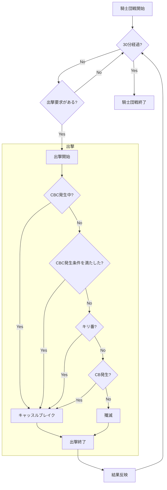
```mermaid
flowchart TD;
    Start[騎士団戦開始];
    ChackTimeLimit{30分経過?};
    ChackAttack{出撃要求がある?};
    CheckCBC{CBC発生中?};
    CheckCBCCondition{CBC発生条件を満たした?};
    Reflected[結果反映];
    End[騎士団戦終了];
    StartPlayerAttack[出撃開始];
    EndPlayerAttack[出撃終了];
    CB[キャッスルブレイク];

    Start --> ChackTimeLimit;
    ChackTimeLimit -- Yes --> End;
    ChackTimeLimit -- No --> ChackAttack;
    ChackAttack -- Yes --> StartPlayerAttack;
    ChackAttack -- No --> ChackTimeLimit;
    EndPlayerAttack --> Reflected;
    Reflected --> ChackTimeLimit

    subgraph 出撃
        CheckChain{キリ番?};
        CheckCB{CB発生?};
        Attack[殲滅];

        StartPlayerAttack --> CheckCBC;        
        CheckCBC -- Yes --> CB;
        CheckCBC -- No --> CheckCBCCondition;
        CheckCBCCondition -- Yes --> CB;
        CheckCBCCondition -- No --> CheckChain;
        CheckChain -- Yes --> CB;
        CheckChain -- No --> CheckCB;
        CheckCB -- Yes --> CB;
        CheckCB -- No --> Attack;
        CB --> EndPlayerAttack;
        Attack --> EndPlayerAttack;
    end
```


## 遷移


### 状態

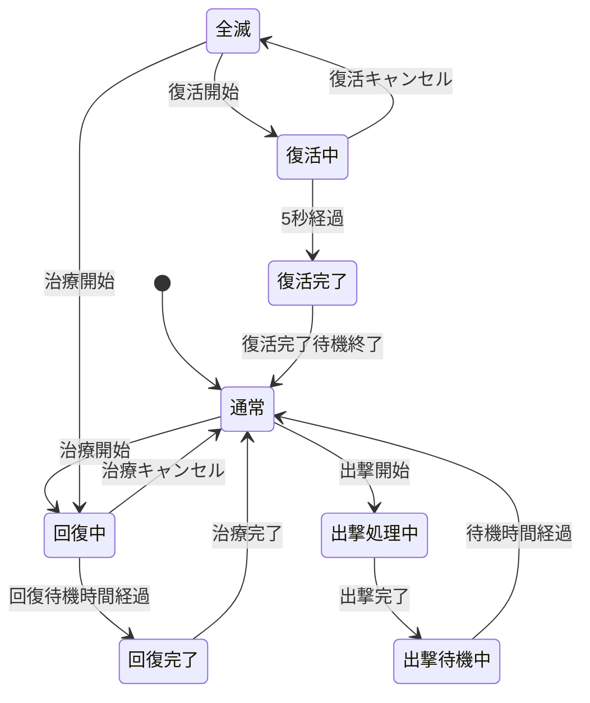
```mermaid
stateDiagram-v2
    [*] --> 通常

    通常 --> 出撃処理中: 出撃開始
    出撃処理中 --> 出撃待機中: 出撃完了
    出撃待機中 --> 通常: 待機時間経過

    通常 --> 回復中: 治療開始
    全滅 --> 回復中: 治療開始
    回復中 --> 通常: 治療キャンセル
    回復中 --> 回復完了: 回復待機時間経過
    回復完了 --> 通常: 治療完了

    全滅 --> 復活中: 復活開始
    復活中 --> 全滅: 復活キャンセル
    復活中 --> 復活完了: 5秒経過
    復活完了 --> 通常: 復活完了待機終了
```


### UI

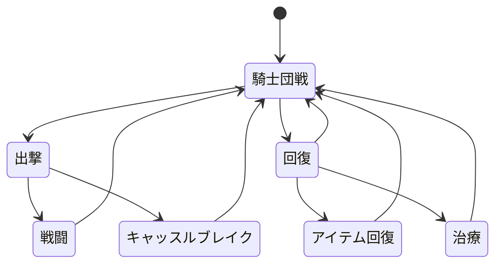
```mermaid
stateDiagram-v2
    [*] --> 騎士団戦
    騎士団戦 --> 出撃
    騎士団戦 --> 回復

    出撃 --> 戦闘
    出撃 --> キャッスルブレイク
    戦闘 --> 騎士団戦
    キャッスルブレイク --> 騎士団戦

    回復 --> 騎士団戦
    回復 --> アイテム回復
    回復 --> 治療

    アイテム回復 --> 騎士団戦
    治療 --> 騎士団戦
```

## シーケンス

### 編成登録時

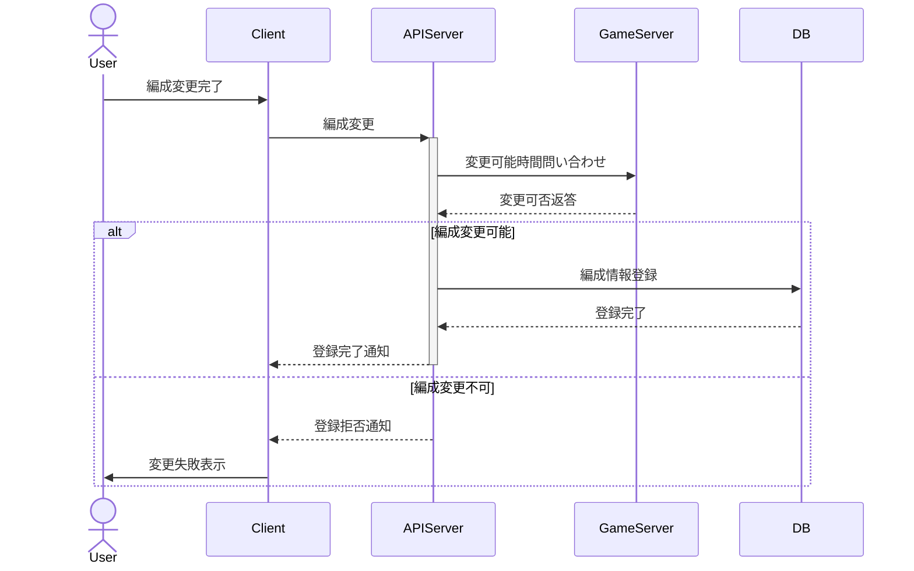
```mermaid
sequenceDiagram
    actor User
    participant Client
    participant APIServer
    participant GameServer
    participant DB

    User->>Client: 編成変更完了
    Client->>+APIServer: 編成変更
    APIServer->>GameServer: 変更可能時間問い合わせ
    GameServer-->>APIServer: 変更可否返答

    alt 編成変更可能
        APIServer->>DB: 編成情報登録
        DB-->>APIServer: 登録完了
        APIServer-->>-Client: 登録完了通知
    else 編成変更不可
        APIServer-->>Client: 登録拒否通知
        Client->>User: 変更失敗表示
    end
```

### 騎士団戦参加時

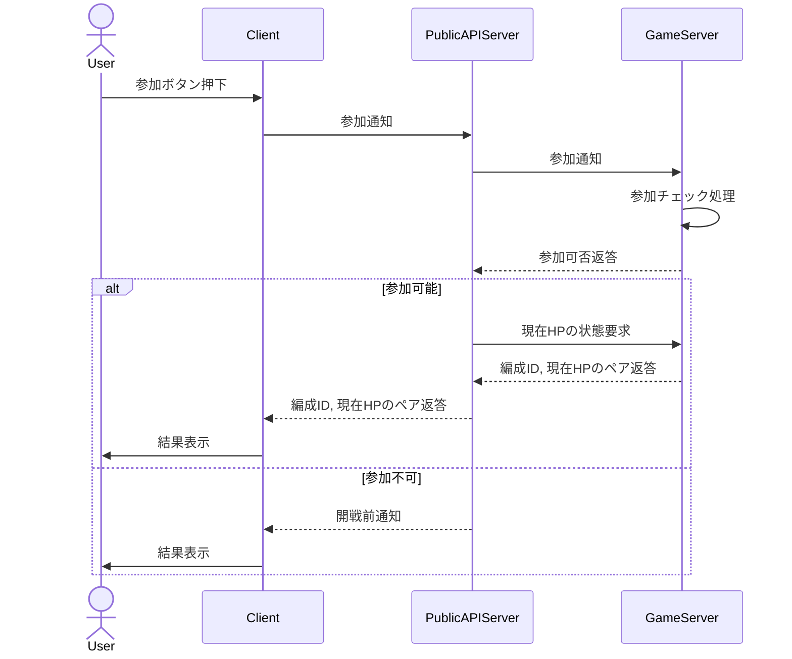
```mermaid
sequenceDiagram
    actor User
    participant Client
    participant PublicAPIServer
    participant GameServer

    User ->> Client: 参加ボタン押下
    Client ->> PublicAPIServer: 参加通知
    PublicAPIServer ->> GameServer: 参加通知
    GameServer ->> GameServer: 参加チェック処理
    GameServer -->> PublicAPIServer: 参加可否返答

    alt 参加可能
        PublicAPIServer ->> GameServer: 現在HPの状態要求
        GameServer -->> PublicAPIServer: 編成ID, 現在HPのペア返答
        PublicAPIServer -->> Client: 編成ID, 現在HPのペア返答
        Client ->> User: 結果表示
    else 参加不可
        PublicAPIServer -->> Client: 開戦前通知
        Client ->> User: 結果表示
    end

```

### 騎士団戦

#### 騎士団戦開戦前

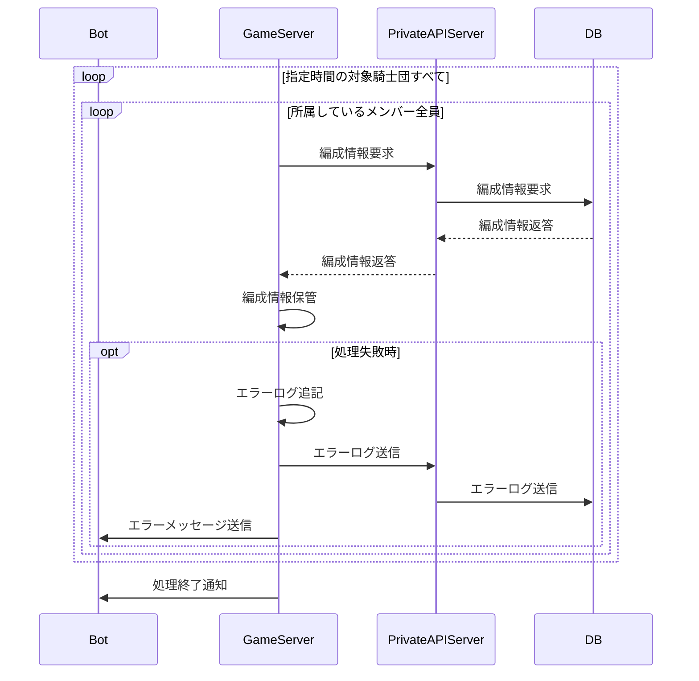
```mermaid
sequenceDiagram
    participant Bot
    participant GameServer
    participant PrivateAPIServer
    participant DB

    loop 指定時間の対象騎士団すべて
        loop 所属しているメンバー全員
            GameServer->>PrivateAPIServer: 編成情報要求
            PrivateAPIServer->>DB: 編成情報要求
            DB-->>PrivateAPIServer: 編成情報返答
            PrivateAPIServer-->>GameServer: 編成情報返答
            GameServer->>GameServer: 編成情報保管

            opt 処理失敗時
                GameServer->>GameServer: エラーログ追記
                GameServer->>PrivateAPIServer: エラーログ送信
                PrivateAPIServer->>DB: エラーログ送信
                GameServer->>Bot: エラーメッセージ送信
            end  
        end
    end
    
    GameServer->>Bot: 処理終了通知
```

#### 騎士団戦中

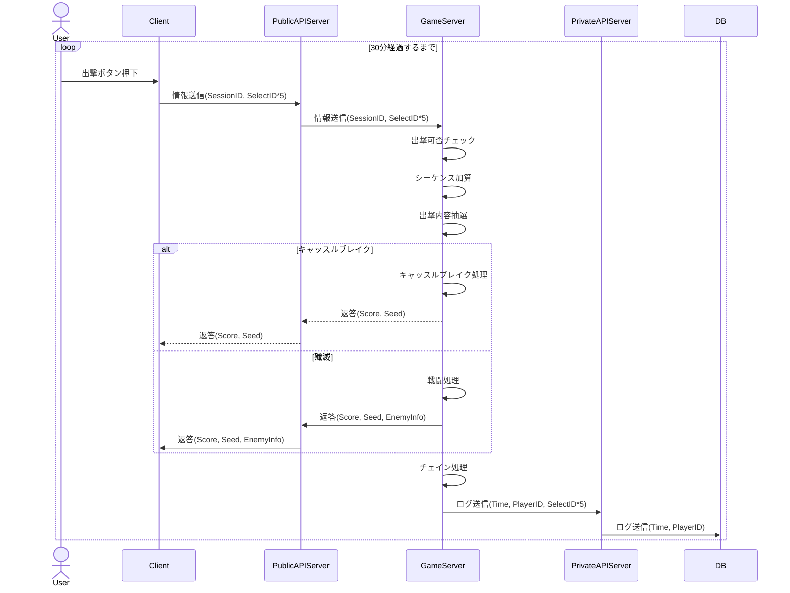
```mermaid
sequenceDiagram
    actor User
    participant Client
    participant PublicAPIServer
    participant GameServer
    participant PrivateAPIServer
    participant DB

    loop 30分経過するまで
        User ->> Client: 出撃ボタン押下
        Client ->> PublicAPIServer: 情報送信(SessionID, SelectID*5)
        PublicAPIServer ->> GameServer: 情報送信(SessionID, SelectID*5)
        GameServer ->> GameServer: 出撃可否チェック
        GameServer ->> GameServer: シーケンス加算
        GameServer ->> GameServer: 出撃内容抽選

        alt キャッスルブレイク
            GameServer ->> GameServer: キャッスルブレイク処理
            GameServer -->> PublicAPIServer: 返答(Score, Seed)
            PublicAPIServer -->> Client: 返答(Score, Seed)
        else 殲滅
            GameServer ->> GameServer: 戦闘処理
            GameServer ->> PublicAPIServer: 返答(Score, Seed, EnemyInfo)
            PublicAPIServer ->> Client: 返答(Score, Seed, EnemyInfo)
        end

        GameServer ->> GameServer: チェイン処理

        GameServer ->> PrivateAPIServer: ログ送信(Time, PlayerID, SelectID*5)
        PrivateAPIServer ->> DB: ログ送信(Time, PlayerID)
    end
```

#### 同時出撃時

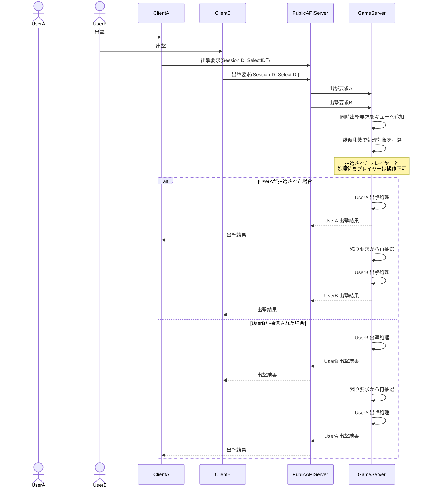
```mermaid
sequenceDiagram
    actor UserA
    actor UserB
    participant ClientA
    participant ClientB
    participant PublicAPIServer
    participant GameServer

    UserA->>ClientA: 出撃
    UserB->>ClientB: 出撃

    ClientA->>PublicAPIServer: 出撃要求(SessionID, SelectID[])
    ClientB->>PublicAPIServer: 出撃要求(SessionID, SelectID[])

    PublicAPIServer->>GameServer: 出撃要求A
    PublicAPIServer->>GameServer: 出撃要求B

    GameServer->>GameServer: 同時出撃要求をキューへ追加
    GameServer->>GameServer: 疑似乱数で処理対象を抽選

    Note over GameServer: 抽選されたプレイヤーと<br/>処理待ちプレイヤーは操作不可

    alt UserAが抽選された場合
        GameServer->>GameServer: UserA 出撃処理
        GameServer-->>PublicAPIServer: UserA 出撃結果
        PublicAPIServer-->>ClientA: 出撃結果

        GameServer->>GameServer: 残り要求から再抽選
        GameServer->>GameServer: UserB 出撃処理
        GameServer-->>PublicAPIServer: UserB 出撃結果
        PublicAPIServer-->>ClientB: 出撃結果
    else UserBが抽選された場合
        GameServer->>GameServer: UserB 出撃処理
        GameServer-->>PublicAPIServer: UserB 出撃結果
        PublicAPIServer-->>ClientB: 出撃結果

        GameServer->>GameServer: 残り要求から再抽選
        GameServer->>GameServer: UserA 出撃処理
        GameServer-->>PublicAPIServer: UserA 出撃結果
        PublicAPIServer-->>ClientA: 出撃結果
    end
```


##### タクティクス使用時

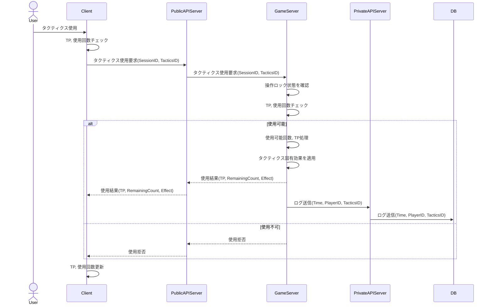
``` mermaid
sequenceDiagram
    actor User
    participant Client
    participant PublicAPIServer
    participant GameServer
    participant PrivateAPIServer
    participant DB

    User->>Client: タクティクス使用
    Client->>Client: TP, 使用回数チェック
    Client->>PublicAPIServer: タクティクス使用要求(SessionID, TacticsID)
    PublicAPIServer->>GameServer: タクティクス使用要求(SessionID, TacticsID)

    GameServer->>GameServer: 操作ロック状態を確認
    GameServer->>GameServer: TP, 使用回数チェック

    alt 使用可能
        GameServer->>GameServer: 使用可能回数, TP処理
        GameServer->>GameServer: タクティクス固有効果を適用
        GameServer-->>PublicAPIServer: 使用結果(TP, RemainingCount, Effect)
        PublicAPIServer-->>Client: 使用結果(TP, RemainingCount, Effect)

        GameServer ->> PrivateAPIServer: ログ送信(Time, PlayerID, TacticsID)
        PrivateAPIServer ->> DB: ログ送信(Time, PlayerID, TacticsID)
    else 使用不可
        GameServer-->>PublicAPIServer: 使用拒否
        PublicAPIServer-->>Client: 使用拒否
    end
    
    Client->>Client: TP, 使用回数更新
```

##### 回復アイテム使用時

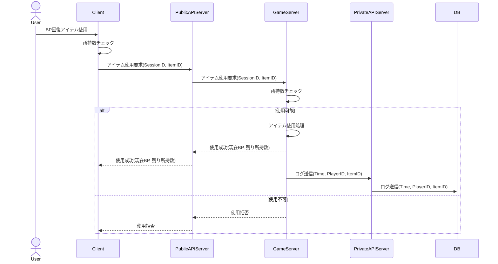
```mermaid
sequenceDiagram
    actor User
    participant Client
    participant PublicAPIServer
    participant GameServer
    participant PrivateAPIServer
    participant DB

    User->>Client: BP回復アイテム使用
    Client->>Client: 所持数チェック
    Client->>PublicAPIServer: アイテム使用要求(SessionID, ItemID)
    PublicAPIServer->>GameServer: アイテム使用要求(SessionID, ItemID)

    GameServer->>GameServer: 所持数チェック

    alt 使用可能
        GameServer->>GameServer: アイテム使用処理
        GameServer-->>PublicAPIServer: 使用成功(現在BP, 残り所持数)
        PublicAPIServer-->>Client: 使用成功(現在BP, 残り所持数)

        GameServer ->> PrivateAPIServer: ログ送信(Time, PlayerID, ItemID)
        PrivateAPIServer ->> DB: ログ送信(Time, PlayerID, ItemID)
    else 使用不可
        GameServer-->>PublicAPIServer: 使用拒否
        PublicAPIServer-->>Client: 使用拒否
    end

```

##### 治療時

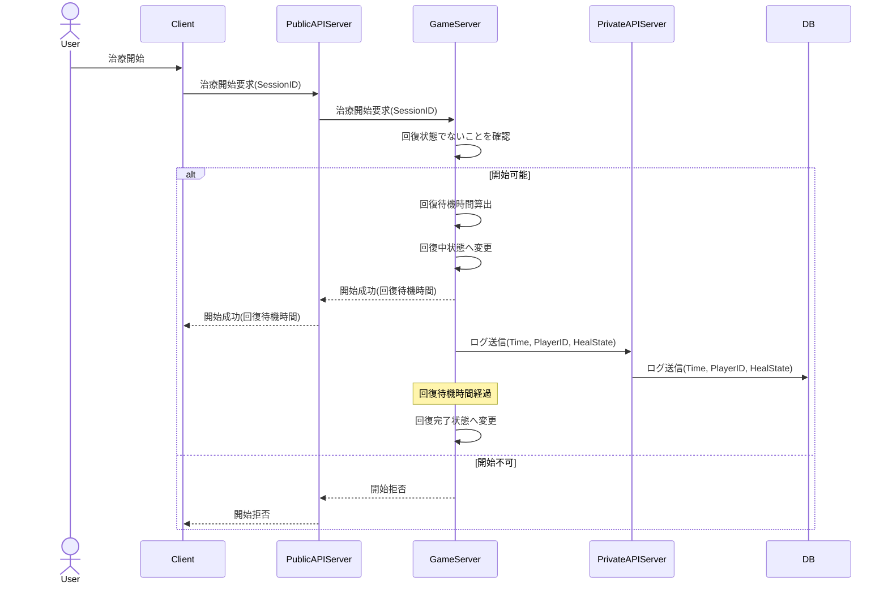
```mermaid
sequenceDiagram
    actor User
    participant Client
    participant PublicAPIServer
    participant GameServer
    participant PrivateAPIServer
    participant DB

    User->>Client: 治療開始
    Client->>PublicAPIServer: 治療開始要求(SessionID)
    PublicAPIServer->>GameServer: 治療開始要求(SessionID)

    GameServer->>GameServer: 回復状態でないことを確認

    alt 開始可能
        GameServer->>GameServer: 回復待機時間算出
        GameServer->>GameServer: 回復中状態へ変更
        GameServer-->>PublicAPIServer: 開始成功(回復待機時間)
        PublicAPIServer-->>Client: 開始成功(回復待機時間)

        GameServer ->> PrivateAPIServer: ログ送信(Time, PlayerID, HealState)
        PrivateAPIServer ->> DB: ログ送信(Time, PlayerID, HealState)

        Note over GameServer: 回復待機時間経過

        GameServer->>GameServer: 回復完了状態へ変更
    else 開始不可
        GameServer-->>PublicAPIServer: 開始拒否
        PublicAPIServer-->>Client: 開始拒否
    end
```


##### 治療キャンセル

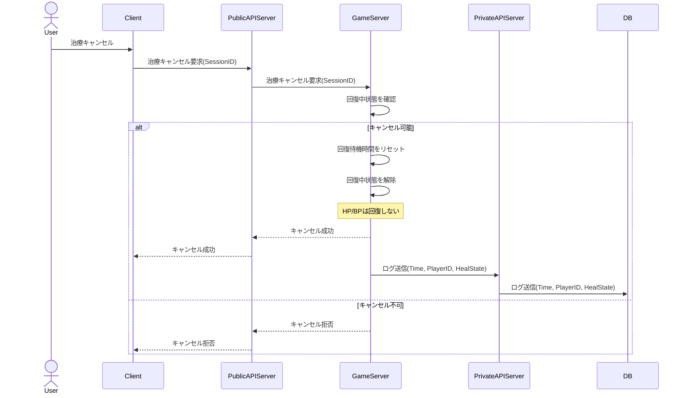
```mermaid
sequenceDiagram
    actor User
    participant Client
    participant PublicAPIServer
    participant GameServer
    participant PrivateAPIServer
    participant DB

    User->>Client: 治療キャンセル
    Client->>PublicAPIServer: 治療キャンセル要求(SessionID)
    PublicAPIServer->>GameServer: 治療キャンセル要求(SessionID)

    GameServer->>GameServer: 回復中状態を確認

    alt キャンセル可能
        GameServer->>GameServer: 回復待機時間をリセット
        GameServer->>GameServer: 回復中状態を解除
        Note over GameServer: HP/BPは回復しない
        GameServer-->>PublicAPIServer: キャンセル成功
        PublicAPIServer-->>Client: キャンセル成功

        GameServer ->> PrivateAPIServer: ログ送信(Time, PlayerID, HealState)
        PrivateAPIServer ->> DB: ログ送信(Time, PlayerID, HealState)
    else キャンセル不可
        GameServer-->>PublicAPIServer: キャンセル拒否
        PublicAPIServer-->>Client: キャンセル拒否
    end
```

##### 治療完了状態解除

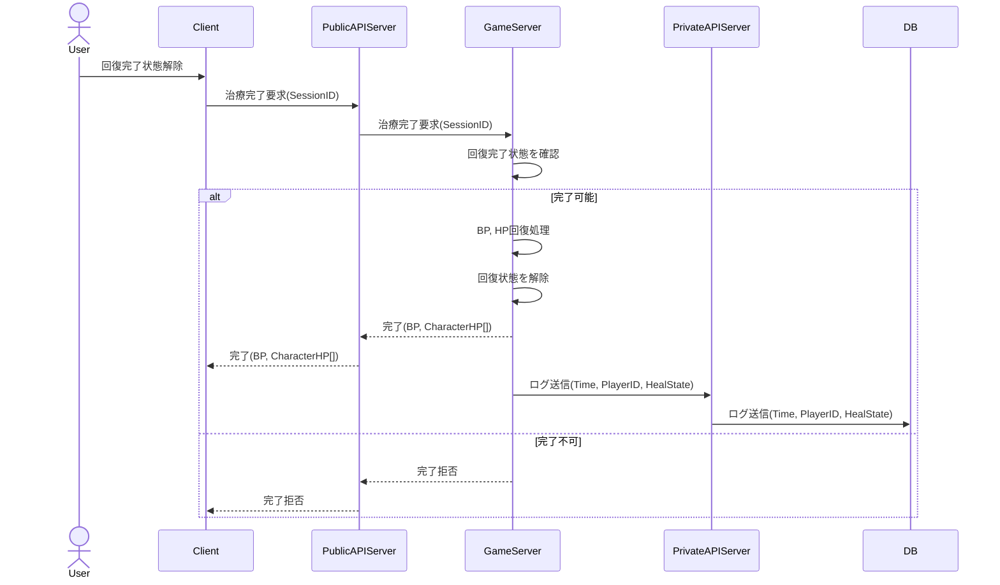
```mermaid
sequenceDiagram
    actor User
    participant Client
    participant PublicAPIServer
    participant GameServer
    participant PrivateAPIServer
    participant DB

    User->>Client: 回復完了状態解除
    Client->>PublicAPIServer: 治療完了要求(SessionID)
    PublicAPIServer->>GameServer: 治療完了要求(SessionID)

    GameServer->>GameServer: 回復完了状態を確認

    alt 完了可能
        GameServer->>GameServer: BP, HP回復処理
        GameServer->>GameServer: 回復状態を解除
        GameServer-->>PublicAPIServer: 完了(BP, CharacterHP[]) 
        PublicAPIServer-->>Client: 完了(BP, CharacterHP[])

        GameServer ->> PrivateAPIServer: ログ送信(Time, PlayerID, HealState)
        PrivateAPIServer ->> DB: ログ送信(Time, PlayerID, HealState)
    else 完了不可
        GameServer-->>PublicAPIServer: 完了拒否
        PublicAPIServer-->>Client: 完了拒否
    end
```

##### 復活

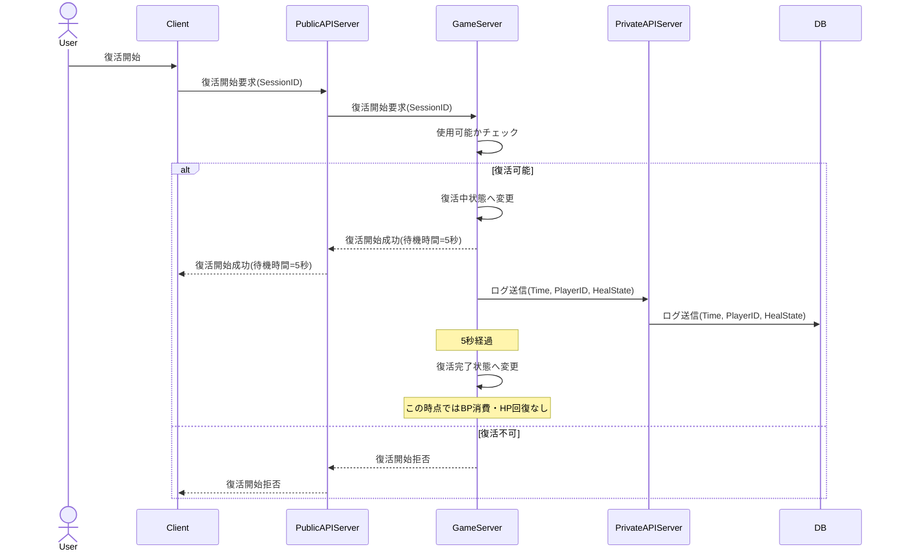
```mermaid
sequenceDiagram
    actor User
    participant Client
    participant PublicAPIServer
    participant GameServer
    participant PrivateAPIServer
    participant DB

    User->>Client: 復活開始
    Client->>PublicAPIServer: 復活開始要求(SessionID)
    PublicAPIServer->>GameServer: 復活開始要求(SessionID)

    GameServer->>GameServer: 使用可能かチェック

    alt 復活可能
        GameServer->>GameServer: 復活中状態へ変更
        GameServer-->>PublicAPIServer: 復活開始成功(待機時間=5秒)
        PublicAPIServer-->>Client: 復活開始成功(待機時間=5秒)

        GameServer ->> PrivateAPIServer: ログ送信(Time, PlayerID, HealState)
        PrivateAPIServer ->> DB: ログ送信(Time, PlayerID, HealState)

        Note over GameServer: 5秒経過

        GameServer->>GameServer: 復活完了状態へ変更
        Note over GameServer: この時点ではBP消費・HP回復なし
    else 復活不可
        GameServer-->>PublicAPIServer: 復活開始拒否
        PublicAPIServer-->>Client: 復活開始拒否
    end
```


##### 復活キャンセル

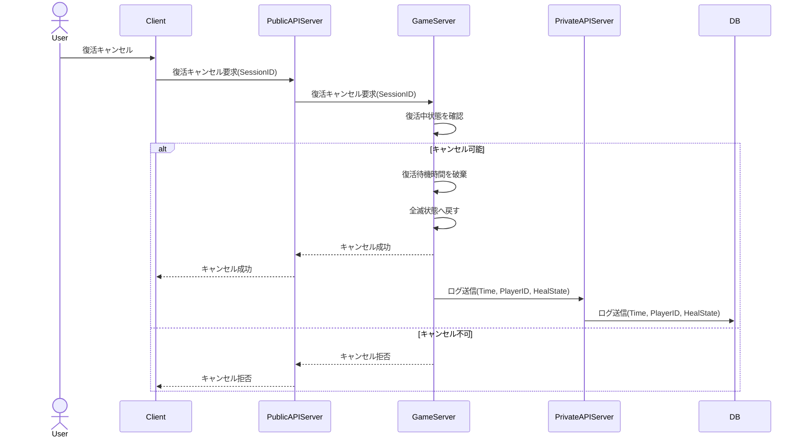
```mermaid
sequenceDiagram
    actor User
    participant Client
    participant PublicAPIServer
    participant GameServer
    participant PrivateAPIServer
    participant DB

    User->>Client: 復活キャンセル
    Client->>PublicAPIServer: 復活キャンセル要求(SessionID)
    PublicAPIServer->>GameServer: 復活キャンセル要求(SessionID)

    GameServer->>GameServer: 復活中状態を確認

    alt キャンセル可能
        GameServer->>GameServer: 復活待機時間を破棄
        GameServer->>GameServer: 全滅状態へ戻す
        GameServer-->>PublicAPIServer: キャンセル成功
        PublicAPIServer-->>Client: キャンセル成功

        GameServer ->> PrivateAPIServer: ログ送信(Time, PlayerID, HealState)
        PrivateAPIServer ->> DB: ログ送信(Time, PlayerID, HealState)
    else キャンセル不可
        GameServer-->>PublicAPIServer: キャンセル拒否
        PublicAPIServer-->>Client: キャンセル拒否
    end
```


##### 復活完了状態解除

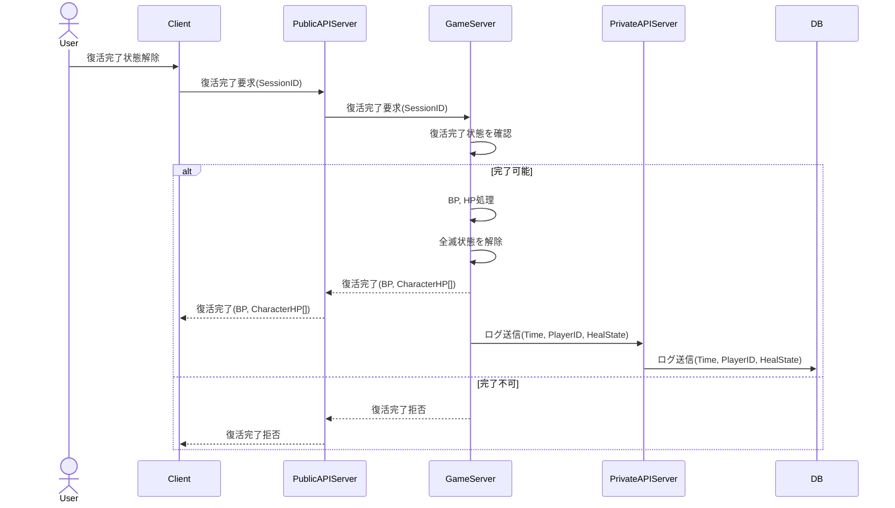
```mermaid
sequenceDiagram
    actor User
    participant Client
    participant PublicAPIServer
    participant GameServer
    participant PrivateAPIServer
    participant DB

    User->>Client: 復活完了状態解除
    Client->>PublicAPIServer: 復活完了要求(SessionID)
    PublicAPIServer->>GameServer: 復活完了要求(SessionID)

    GameServer->>GameServer: 復活完了状態を確認

    alt 完了可能
        GameServer->>GameServer: BP, HP処理
        GameServer->>GameServer: 全滅状態を解除
        GameServer-->>PublicAPIServer: 復活完了(BP, CharacterHP[])
        PublicAPIServer-->>Client: 復活完了(BP, CharacterHP[])

        GameServer ->> PrivateAPIServer: ログ送信(Time, PlayerID, HealState)
        PrivateAPIServer ->> DB: ログ送信(Time, PlayerID, HealState)
    else 完了不可
        GameServer-->>PublicAPIServer: 復活完了拒否
        PublicAPIServer-->>Client: 復活完了拒否
    end
```

#### 騎士団戦終了時

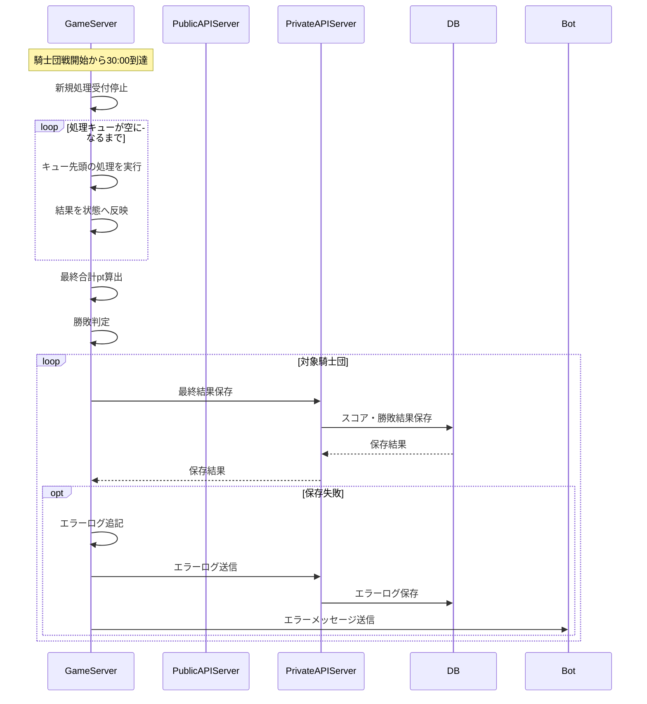
```mermaid
sequenceDiagram
    participant GameServer
    participant PublicAPIServer
    participant PrivateAPIServer
    participant DB
    participant Bot

    Note over GameServer: 騎士団戦開始から30:00到達

    GameServer->>GameServer: 新規処理受付停止

    loop 処理キューが空になるまで
        GameServer->>GameServer: キュー先頭の処理を実行
        GameServer->>GameServer: 結果を状態へ反映
    end

    GameServer->>GameServer: 最終合計pt算出
    GameServer->>GameServer: 勝敗判定

    loop 対象騎士団
        GameServer->>PrivateAPIServer: 最終結果保存
        PrivateAPIServer->>DB: スコア・勝敗結果保存
        DB-->>PrivateAPIServer: 保存結果
        PrivateAPIServer-->>GameServer: 保存結果

        opt 保存失敗
            GameServer->>GameServer: エラーログ追記
            GameServer->>PrivateAPIServer: エラーログ送信
            PrivateAPIServer->>DB: エラーログ保存
            GameServer->>Bot: エラーメッセージ送信
        end
    end
```

