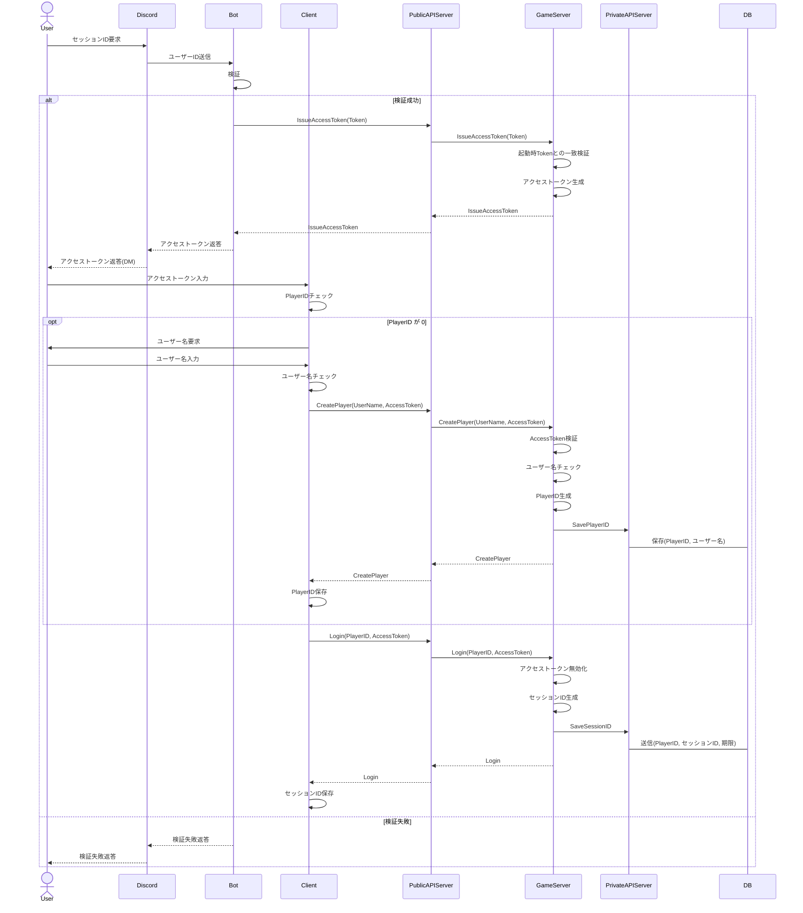
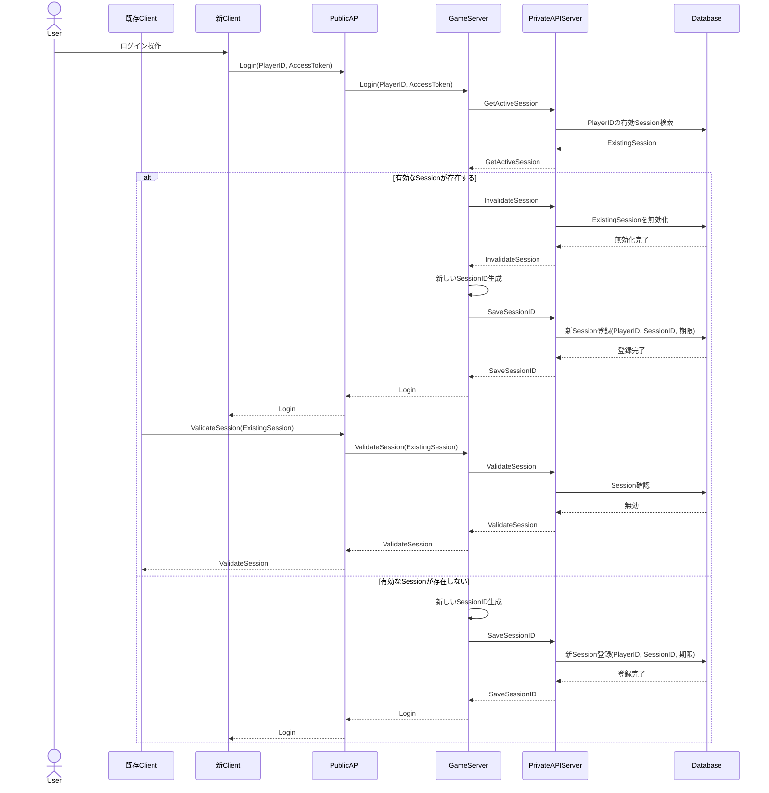

# セッション仕様

* 複数端末からのアクセスは不可
* OPFS上に保存される
* セッションIDの期限は72時間
  - 以下アクション時に期限がリセットされる
    - ログイン時
    - 騎士団戦参加時

### セッションID新規取得

GameServerはBotから起動される. BotはGameServer起動時に`[a-zA-Z0-9_]{64}`のTokenを生成し, 起動引数としてGameServerへ渡す.
botの検証は特定のロールを持っているか, 前回要求時から5分以上経過しているか
アクセストークンの期限は5分
アクセストークンおよびセッションIDの型は「[型定義](types.md)」を参照

#### 複数端末ログイン時

